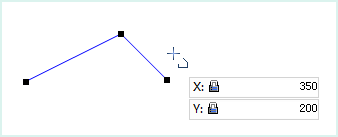
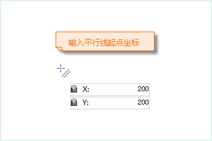
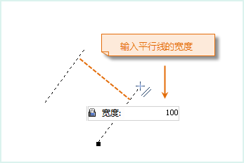
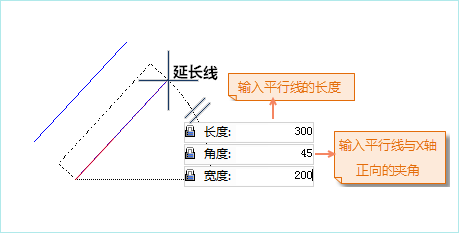

---
id: DrawPolyLine
title: 绘制折线  
---  
### 使用说明

“折线”命令用来创建多折线。在实际的应用中，线对象主要用来描述线状地物，如河流、铁路、道路、电力线等。应用程序也提供了多种绘制折线的方式，满足不同应用情景下的绘制要求。

### 操作步骤

**通过输入坐标值绘制折线**

  1. 在“ **对象操作** ”选项卡的“ **对象绘制** ”组中，单击“ **线** ”下拉按钮，选择“ **折线** ”选项。
  2. 将鼠标移动到地图窗口中，可以看到随着鼠标的移动，其后的参数输入框中会实时显示该点的坐标值。在该框中输入折线一个节点的坐标值（可以通过按 Tab 键，在两个输入框间切换）后按 Enter 键，确定折线的起始位置。
  3. 移动鼠标并在其后的参数框中输入下一个节点的坐标值，按 Enter 键，完成折线的第一段线的绘制。
  4. 继续移动光标到合适的位置，输入 X、Y 坐标值后，按 Enter 键，绘制折线的下一段线。
  5. 重复上一步骤，完成折线其它线段的绘制。
  6. 单击鼠标右键结束当前绘制操作。

注意：当用户编辑参数输入框中的数值时，该输入框将处于锁定状态，即参数输入框中的数值不随鼠标的移动而变化，只显示用户输入的数值；按 Tab 键可以在 X、Y
坐标输入框之间切换焦点，即编辑状态。按住 Esc 键可以取消当前参数输入框的锁定状态。

 |  |  |  |   
---|---|---|---|---  
输入第一个点的坐标 |  | 输入第二个点的坐标 |  | 输入第三个点的坐标

**通过输入长度和角度绘制折线**

  1. 在“ **对象操作** ”选项卡的“ **对象绘制** ”组中，单击“ **线** ”下拉按钮，选择“ **折线(长度、角度)** ”命令，出现折线光标。
  2. 将鼠标移动到地图窗口中，可以看到随着鼠标的移动，其后的参数输入框中会实时显示当前鼠标位置的坐标值。在该文本框中输入折线一个节点的坐标值（可以通过按 Tab 键，在两个参数输入框间切换）后按 Enter 键，确定折线的起始位置。
  3. 移动鼠标，可以看到随着鼠标的移动，地图窗口中会实时标识鼠标位置与上一个节点（折线起点）连线的长度及其与 X 轴正向之间的夹角，在参数输入框中输入长度和角度值（可以通过按 Tab 键，在两个参数输入框间切换），按 Enter 键执行输入，完成折线第一段线的绘制。
  4. 同样的方法输入下一个节点与其上一个节点之间的距离值及其连线与 X 轴正向之间的夹角，按 Enter 键，绘制折线的下一段线。
  5. 使用同样的方法绘制折线的其他线段。
  6. 单击鼠标右键结束绘制折线的操作。

### 绘制平行线

**通过输入坐标值绘制平行线**

“平行线”命令用来绘制有两个子对象的平行线。

  1. 在“ **对象操作** ”选项卡的“ **对象绘制** ”组中，单击“ **线** ”下拉按钮，选择“ **平行线** ”命令，出现平行线光标。
  2. 将鼠标移动到地图窗口中，可以看到随着鼠标的移动，其后的参数输入框中会实时显示当前鼠标位置的坐标值。在该框中输入平行线起点的坐标值（可以通过按 Tab 键，在两个输入框间切换）后按 Enter 键，确定平行线的起始位置。
  3. 移动鼠标并在其后的参数输入框中输入平行线的宽度（长度），按 Enter 键执行输入。
  4. 移动鼠标，可以看到平行线的宽度已经确定，地图窗口中会实时标识鼠标位置与起点连线的长度及其与 X 轴正方向之间的夹角。在参数输入框中输入长度和角度值（可以通过按 Tab 键，在两个参数输入框间切换），按 Enter 键确认后即可确定平行线的长度。
  5. 其后绘制平行线其它段的操作步骤与绘制折线类似。此时绘制的平行线都是与上面步骤中等宽的平行线。
  6. 单击鼠标右键结束平行线的绘制。

平行线绘制的过程如下图所示：

|  |  |   
---|---|---  
输入平行线的起点 | 输入平行线的宽度 | 输入平行线的长度和角度  

