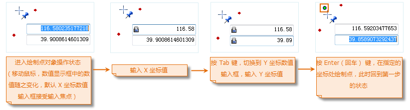

---
id: Point
title: 绘制点对象  
---  
在 GIS 应用中，我们常常用点对象描述一些点状地物，如高程控制点、矿井、山洞等。 在“ **对象操作** ”选项卡上的“ **对象绘制**
”组中组织了绘制点对象的按钮，可以在当前可编辑的图层为点图层或 CAD 图层时绘制点对象。

### 操作步骤

  1. 在“ **对象绘制** ”组中，单击“ **点** ”按钮，进入绘制状态。
  2. 将鼠标移至地图窗口中，随着鼠标的移动，会出现两个参数输入框，用来显示和设置当前鼠标位置的坐标值。在输入框中输入 X、Y 坐标值作为绘制的点对象位置。按 Enter 键确认绘制。在地图窗口中会显示绘制的点对象。
  3. 重复上一步骤，可绘制多个点对象。
  4. 绘制完成后，单击鼠标右键结束绘制。

注意：当用户编辑参数输入框中的数值时，该输入框将处于锁定状态，即参数输入框中的数值不随鼠标的移动而变化，只显示用户输入的数值；按 Tab 键可以在 X、Y
坐标输入框之间切换焦点，即编辑状态。如想重新输入数值，按住 Esc 键可以取消当前参数输入框的锁定状态。

  

  
### 备注

结束点对象绘制有以下两种方式：

  1. 在地图窗口中任意非点对象所在位置单击鼠标右键。
  2. 在“ **对象操作** ”选项卡“ **对象绘制** ”组中，再次单击绘制点对象按钮。

