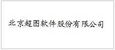
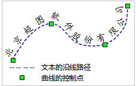

---
id: Text
title: 绘制文本对象  
---  
在“ **对象操作** ”选项卡的" **对象绘制** "组中“ **文本**
”按钮用于在地图上绘制文本对象，该组中的功能只有在当前可编辑的图层为文本图层或复合图层时才可用。

### 操作步骤
文本对象绘制  

按钮 |说明|功能及操作方法|示意图  
--|--|--|--
 | 绘制普通文本 |单击该按钮，出现普通文本光标；在地图上需要添加文本的位置单击鼠标左键，显示闪烁的光标；输入文本。输入文本时，文本在闪烁的光标处显示；点击Enter 键可另起一行。|  
|绘制沿线标注 |沿着某一条曲线创建文本。单击该按钮,出现沿线标注文本光标；在地图上创建沿线标注文本的位置，单击鼠标左键，确定沿线标注文本的起始点，然后按照绘制曲线的方式绘制文本的沿线路径；沿线路径绘制完后，单击鼠标右键，弹出“沿线注记”对话框；在编辑框中输入沿线标注文本内容。 点击“确定”按钮，完成绘制沿线标注文本操作。|  
  
### 备注

* 结束文本绘制有以下两种方式： 
  * 在地图窗口中任意非文本框所在区域单击鼠标右键。
  * 或者再次点击“对象操作”选项卡的"对象绘制"组中的文本绘制按钮。
* 沿线文本是由若干个子文本对象组成的，其中单个汉字、连续字母、连续数字都被看作是一个子文本对象，空格占字符位但不计为子对象，主要用来分开连续的字符或数字。例如“中国北京BeiJing China”有六个子对象，分别为中、国、北、京、BeiJing、China，字符 BeiJing 和 China 之间就是使用空格隔开的。如果输入连续的字母或者数字，则会视为单个子对象，不会对其进行沿线标注。如需要达到沿线标注的效果，请在适当的位置使用空格进行分割。可以在对象“属性”对话框的文本信息选项卡中查看/修改每一个子对象的内容。 
* 沿线文本走向为曲线方向，因此创建沿线文本时，要注意所绘制的曲线的方向。
* 新建的文本数据集默认文本风格为：宋体，字体大小默认为14号，字体颜色为黑色，背景透明。
* 若绘制文本对象时，设置了文本对象的风格，则会将最近一次设置的文本风格作为风格模板，应用于则后续绘制的文本对象。

