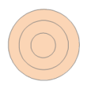
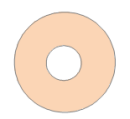
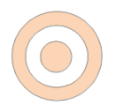

---
id: AboutEdittingGeometry
title: 对象编辑概述  
---  
对象编辑是对几何对象的常用操作，例如我们在绘制中国地图的时候，需要将南海诸岛合并成一个复杂对象，方便统一操作。又如在处理土地变更时，使用局部更新功能，对发生变化的土地边界进行更新即可。
产品提供了多达28种常用的编辑功能，为处理数据带来极大的便利。

本文档主要对相近的对象编辑操作进行了对比，方便用户区分。

### 组合与合并

  * 合并适用于面图层、CAD 图层（相同类型的对象），组合适用于线图层、面图层、文本图层和 CAD 图层。
  * 合并只能对同一类型的对象进行操作生成复杂对象，而组合可以对不同类型的对象进行操作而生成复合对象。
  * 参与合并的对象被融合成一个简单对象或复杂对象；而参与组合对象只是被组合成一个块，成为一个复合对象，而不进行融合。
  * 合并不能对点对象进行操作，组合能对点对象进行操作。
  * 合并运算时，非系统字段和字段 SmUserID 数据采用多种操作方式（保留第一个、为空、求和及平均）进行处理；组合运算时，非系统字段字段 SmUserID 保留组合对象中 SmID 值最小的对象的相应属性值。

### 偏移与移动

  * 移动适用于所有几何对象；偏移适用于简单对象以及包含子对象复杂对象，不适用于 CAD 图层中的复合对象。
  * 移动操作不会产生新对象，只是位置的改变；偏移会产生与源对象形状平行的新对象。

### 分解与炸碎

  * 分解适用于线图层、面图层、文本图层、CAD 图层，炸碎适用于线图层、CAD 图层。
  * 分解的适用对象可以是复杂对象或者复合对象，炸碎的适用对象只能是线对象。
  * 分解是将组成复杂对象的子对象和复合对象的组成对象分解成单一对象，而炸碎是将对象在节点处炸开生成简单对象。

### 异或与岛洞多边形

  * 异或操作是两两对象公共部分被删除，剩余部分合并；而岛洞多边形是根据选择对象相交部分的奇偶性来判断的。

具体如下图所示：

  
  
编辑操作|原始对象|操作结果  
--|--|--
异或 |  |  |  
/| 三个简单对象 | 两个子对象的复杂对象  
 岛洞多边形 |  |  |  
 /| 三个简单对象 | 三个子对象的复杂对象  
  
