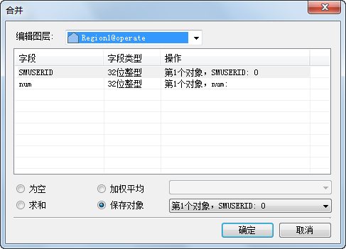

---
id: AttributeDiag
title: 属性处理对话框说明  
---  
我们在对几何对象进行求交、合并、异或、连接线等操作时，需要考虑生成的新对象的属性赋值问题。应用程序提供了属性处理对话框，方便用户对操作后对象的属性进行设置。这里将以合并为例，说明属性处理对话框。

  

  
### 编辑图层

“编辑图层”标签右侧的下拉列表中列出了图层管理器中可编辑的图层。当有多个图层可编辑时，需要选择合并操作进行的图层，即最终要把结合对象合并到哪个图层上去。其他图层的对象保持不变。

### 列表框

列表框其余显示合并对象所有非系统字段和可编辑系统字段的名称、类型以及合并后各字段值的操作步骤。若要修改一个字段的操作步骤，可以在此列表框中选中该字段后，在“操作”列中重新选择操作步骤。

### 操作步骤

  * **为空** :指合并结果对象此字段的值为空。
  * **求和** :指合并结果对象此字段的值为各个合并对象相应字段值的和。数值型字段直接相加求和。文本型字段求和时多个对象的文本按照 SmID 顺序自动进行连接。
  * **加权平均** :指合并结果对象此字段的值（必须是数值型的字段）为所有合并对象此字段的平均值。既可以计算简单平均值，也可以计算加权平均值。默认计算简单平均值。 

选中“平均”单选按钮，单击右侧的下拉按钮，选择“无加权字段（平均）”项，即不使用加权字段时，表示计算简单平均值，将所有源对象的选中字段值相加然后除以源对象的个数。

若在“平均”单选按钮右侧的下拉菜单，选择其一个字段，表示使用该字段与列表框中的选中的字段进行加权平均运算。

  * **保存对象** :指操作结果对象此字段的值与第几个已经选择的对象的此字段值相同，在切换选择的对象时，地图上会高亮显示所选择的保留对象，使得用户可清晰的辨别所选对象在地图中的位置。

