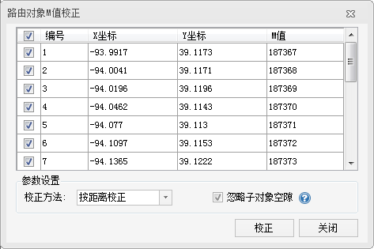
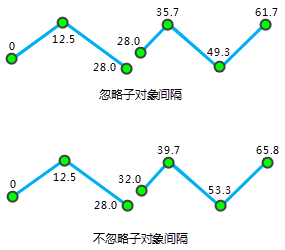

---
id: CalibrateRouteM
title: 校正路由对象M值  
---  
### 使用说明

路由对象是一组具有X，Y坐标与线性度量值（M
值）的点组成的线性地物对象。比如高速公路上的里程碑，交通管制部门经常使用高速公路上的里程碑来标注并管理高速公路的路况、车辆的行驶限速和高速事故点等。路由对象M校正是调整路由测量值，使其与已知的参考点保持一致的过程。有关校正路由的更多内容，请参阅[校准路由概述](../../../DynamicSeg/AboutCalibrate.htm)。

### 操作步骤

  1. 将路由数据添加到地图窗口中，并将该图层设置为可编辑状态，并选中一个需进行 M 值校准的路由对象。
  2. 在“ **对象操作** ”选项卡的“ **对象编辑** ”组的 Gallery 控件中，单击“ **M值校准** ”按钮，弹出“路由对象M值校正”窗口，如下图所示：  

  
 
  3. 对话框的列表处显示了路由对象的坐标和M值，用户可勾选路由节点作为M值校正的参考点，选中的路由对象节点，会在地图窗口中高亮显示，且可在列表中直接修改参考点的M值。
  4. 在参数设置处设置校正方式，校正方式分为：按距离校准和按刻度值校准两种。有关这两种校准方式的介绍，请参见[校准路由概述](../../../DynamicSeg/AboutCalibrate.htm)相关内容的介绍。 
  * **按距离校准** ：根据参考点基于两点间的沿路由的距离来计算 M 值。
  * **按刻度值校准** ：利用参考点对应路由上位置的刻度值来进行校准。当被校准的路由的长度与刻度值的比值不一致时，这种方法非常适用于对路由的刻度值进行微调。
  5. **忽略子对象空隙：** 设置是否忽略子对象之间的间隔。默认忽略子对象之间的间隔。路由可以是包含多个子对象的复杂对象。当两个子对象不连续时，就会产生间隔。是否忽略子对象的间隔影响着路由刻度值的连续性，如果忽略子对象的间隔，刻度值将是连续的，否则就是不连续的，此时子对象的间隔的距离就是两个端点的直线距离。

如下图所示，忽略子对象间隔时，第一个子对象的终点的 M 值和第二个子对象起点的 M 值相同；不忽略子对象间隔时，第二个子对象的起点的 M 值就是第一个子对象的终点 M 值加上两者的间隔的直线距离 。
  
  6. 设置好以上参数之后，单击“校正”按钮，执行该操作。

###  注意事项

1. 用于校准路由的参考点至少为2个，建议采用离待校准节点最近的两个参考点来校准。
2. 若参考点的M值为无值即-9999，则路由对象M值校正会失败。

###  相关主题

[校准路由概述](../../../DynamicSeg/AboutCalibrate.htm)

[校准路由](../../../DynamicSeg/CalibrateRoute.htm)

  

