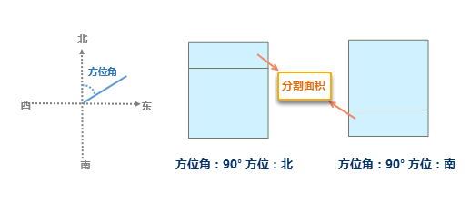
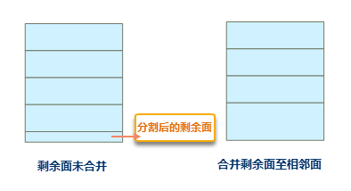

---
id: CutByArea
title: 按面积分割  
---  
### 使用说明

通过指定分割方向将被分割面对象按面积以指定块数分割或等比例分割。目前支持投影坐标系和平面坐标系数据，不支持地理坐标系数据分割。该功能可用于土地分配，能够实现指定面积、指定方位的精确分割。

**注** ：只有当前地图窗口中有可编辑的图层且图层中存在一个或多个选中对象时，“画面分割”按钮才可用。当数据为地理坐标系时，该按钮不可用。

### 操作步骤

1. 将地图窗口中要进行分割的面几何对象所在的图层设置为可编辑状态，选中一个或多个分割面对象。
2. 在“ **对象操作** ”选项卡的“ **对象编辑** ”组的 Gallery 控件中，单击“ **按面积分割** ”按钮，弹出“ **按面积分割** ”对话框。
3. 在对话框上侧列表框中显示选中的被分割面对象 SmID 和 面积（平方米）。可选中逐个设置单个被分割对象的分割条件，也可多选或者全选统一设置分割条件。
4. **指定分割方向** :设置方位角和方位两个参数。 
  * **方位角** ：设置切割线与正北方向的顺时针夹角。
  * **方 位** ：设置切割的方位。如果切割方位角为0或180度，则切割方位不能为北和南，如果切割方位角为90或270度，切割方位不能为东和西。 

如下图所示将一块100000平方米的土地，分割出一块30000平方米的对象，设置方位角为90°，方位分别选择南、北两个方向。当方位为“南”时，切割对象的南侧，当方位为“北”时，切割对象的北侧。得到如下结果：

  
 
5. **指定分割方式** :用户可选择两种分割方式，包括：   

  * **按面积分割** ：指定被分割面的面积。按该面积将对象分割成多块，由 **块数** 决定分割的数目。切割块数不能大于（切割前面对象面积/切割面积）。 
  * **按块数分割** ：根据指定块数，将对象等份切割，此时 **块数** 表示最终切割后面数目。  
   
6. **合并剩余面至相邻面** ：在按面积切割多边形时，有可能会存在剩余的面对象，勾选该选框，则程序会将小于等于指定的 **合并面积** 的剩余面合并至相邻面。不勾选则不合并。如下图所示： 

**注意** ：剩余面的面积小于等于设定的合并面积才能做合并操作，否则不能合并。

  
 
7. 单击“确定”按钮，执行按面积分割的操作。

