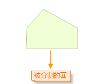
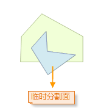
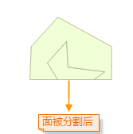
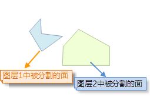
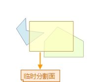
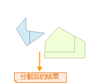

---
id: CutByPolygon
title: 画面分割  
---  
### 使用说明

“画面分割”：通过绘制的临时分割面来分割面或者面几何对象。

只有当前地图窗口中有可编辑的图层且图层中存在一个或多个选中对象时，“画面分割”按钮才可用。

当开启多图层编辑时，所画的临时分割面会分割所穿越的所有可编辑图层中被选中线或者面几何对象，这些对象可以位于不同的图层上。

### 操作步骤

1. 将地图窗口中要进行分割的线或者面几何对象所在的图层设置为可编辑状态。
2. 用户不需要选中线或者面几何对象，直接对几何对象进行分割操作，临时分割面所穿越的所有可编辑的线或者面几何对象都将被分割。
3. 在“ **对象操作** ”选项卡的“ **对象编辑** ”组的 Gallery 控件中，单击“ **画面分割** ”按钮，执行画面分割操作。此时，当前地图窗口中的操作状态为画面分割面或者面对象状态。
4. 绘制临时分割面，即绘制用于分割面或者面几何对象的临时面，具体操作为：鼠标移动到地图窗口时变为  状态，此时，就可以绘制分割面，在适当位置处单击鼠标左键确定分割面的第一个点，移动鼠标，经出现随鼠标移动而不断变化的临时线段，在适当位置处单击鼠标确定分割面的下一个点，继续单击鼠标，绘制临时分割面的其他点。
5. 临时分割面绘制完成后，右键单击鼠标，结束临时分割面绘制，此时，将执行分割操作，同时临时分割面消失。
6. 分割的结果为：临时分割面所穿越的所有可编辑图层中被选中线或者面几何对象都将在与分割面相交处被分割。
7. 继续进行下一次的画面分割操作，重复上面第 4 步的操作；如果要添加其他数据中的线或者面几何对象进行切割，那么添加数据并将数据对应的图层设置为可编辑状态，然后在重复上面第 4 步的操作。
8. 取消画面分割的操作状态，只需单击“画面分割”按钮，使按钮处于非按下状态。

### 画面分割操作图示：

 |  |  
---|---|---  

**跨图层分割**

 |  |   
---|---|---  

###  注意事项

* 当启动了多图层编辑时，用户可以同时画面分割多个可编辑图层中的线或者面几何对象。

### 备注

自相交的面对象，如漏斗状的面对象，不支持画面分割。

