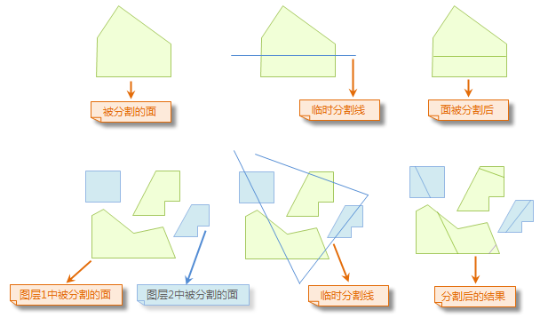
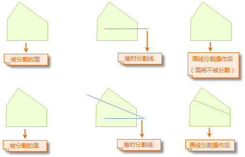

---
id: CutPolygon
title: 画线分割  
---  
### 使用说明

“画线分割”：通过绘制的临时分割线来分割线或者面几何对象。

只有当前地图窗口中有可编辑的图层且图层中存在一个或多个选中对象时，“画线分割”按钮才可用。临时分割线所穿越的所有可编辑图层中被选中线或者面几何对象都将被分割。

### 操作步骤

  1. 将地图窗口中要进行分割的线或者面几何对象所在的图层设置为可编辑状态。
  2. 单击选中需要进行分割的线或者面几何对象。或者，通过框选或按住Shift键选择多个几何对象。
  3. 在“ **对象操作** ”选项卡的“ **对象编辑** ”组的 Gallery 控件中，单击“画线分割”按钮，执行画线分割操作。此时，当前地图窗口中的操作状态为画线分割线或者面对象状态。
  4. 绘制临时分割线，即绘制用于分割面几何对象的临时折线，具体操作为：鼠标移动到地图窗口时变为  状态，此时，就可以绘制分割线，在适当位置处点击鼠标左键确定分割线的第一个点，移动鼠标，经出现随鼠标移动而不断变化的临时线段，在适当位置处点击鼠标确定分割线的下一个点，继续点击鼠标，绘制临时分割线的其他点。
  5. 临时分割线（折线）绘制完成后，右键点击鼠标，结束临时分割线绘制，此时，将执行分割操作，同时临时分割线消失。
  6. 分割的结果为：临时分割线所穿越的所有可编辑图层中被选中线或者面几何对象都将被分割。
  7. 继续进行下一次的画线分割操作，重复上面第 4 步的操作；如果要添加其他数据中的线或者面几何对象进行切割，那么添加数据并将数据对应的图层设置为可编辑状态，然后在重复上面第 4 步的操作。
  8. 取消画线分割的操作状态，只需点击“画线分割”按钮，使按钮处于非按下状态。

### 画线分割操作图示：

  

  
###  注意事项

  1. 当启动了多图层编辑时，用户可以同时画线分割多个可编辑图层中的线或者面几何对象。
  2. 只有临时分割线完全穿过可编辑的线或者面几何对象，该几何对象才会被分割，如下面的示意图所示。
  

### 备注

自相交的面对象，如漏斗状的面对象，不支持画线分割。

