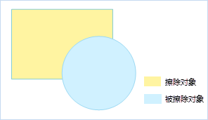

---
id: ExternalErase
title: 擦除外部  
---  
### 使用说明

擦除外部功能用来将目标对象（被擦除对象）中与擦除对象不重叠的部分进行删除。

 
  
  * 擦除外部功能只有在选中面对象作为擦除对象时才可用。
  * 被擦除对象可以是多个线对象或面对象，但擦除对象必须为一个面对象。
  * 擦除操作支持跨图层操作。要求被擦除对象所在的图层必须为可编辑。在[多图层编辑](../CreateObjects/DTv2_Editable)的情况下，擦除图层和被擦除图层可以同时处于可编辑状态。

### 操作步骤

  1. 在图层可编辑状态下，选择一个面对象作为擦除对象。 
  2. 在“ **对象操作** ”选项卡的“ **对象编辑** ”组的 Gallery 控件中，单击“ **擦除外部** ”按钮，执行擦除外部操作。
  3. 鼠标提示“请选择被擦除的对象”，选择的被擦除对象可以是线和面对象，单击鼠标左键依次选中被擦除对象，即可擦除被擦除对象中与擦除对象不重叠的部分，单击鼠标右键完成擦除操作。

