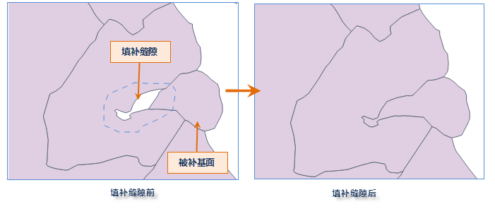

---
id: FillGap
title: 填补缝隙  
---  
### 使用说明

填补缝隙功能用于当两个对象之间存在缝隙时， 需要将缝隙合并到其中一个对象当中去，以消除缝隙。方便用户通过拓展当前面对象来填补该对象与周围面对象之间的缝隙。

  * 填补缝隙操作需先选择对象作为被补基面。
  * 填补缝隙操作支持跨图层操作。要求被补对象所在的图层必须为可编辑。 

### 操作步骤

  1. 将当前面图层处于可编辑状态。在“ **对象操作** ”选项卡的“ **对象编辑** ”组的 Gallery 控件中，单击“ **填补缝隙** ”按钮，执行填补缝隙操作。
  2. 当前地图窗口鼠标提示“请选择被补基面”，左键选择一个基面作为被补的面对象。
  3. 选中被补基面后，鼠标变为十字光标提示“请绘制补缝隙范围！”，此时，就可以绘制需要补缝的范围。 **绘制范围时需注意:**
    * 绘制范围的多边形必须与被补基面有交集，否则程序将提示“补缝隙失败，您绘制的补缝隙范围不符合要求，请重新绘制。”
    * 当绘制补缝隙范围大于相邻非被补基面对象时，程序会对二者重叠的部分进行删除，删除后的部分即为需要补缝的范围。
  4. 单击右键结束补缝范围的绘制，程序将补缝范围与被补基面合并为一个对象。
  
---  
