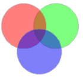

---
id: Group
title: 组合  
---  
组合功能将当前图层中任意对象（相同类型或不同类型的几何对象）组合成一个复合对象。

### 使用说明

  * 对相同或不同类型对象进行组合操作生成一个新的复合对象。对于线和面图层中的相同类型的对象可以进行组合。对 CAD 复合图层中的不同类型的对象可以进行组合。
  * 新生成的复合对象的属性信息中系统字段（除 SmUserID 外）由系统赋值，字段 SmUserID 和非系统字段继承参与组合的对象中 SmID 值最小的对象的相应信息。
  * 支持对跨图层的几何对象进行组合。
  * 在点数据集中，不支持点对象的组合。
  * 对象重叠面个数为偶数时，组合后此区域显示为白色，是结果数据的一部分。

### 操作步骤

  1. 在图层可编辑状态下，选中两个或者多个对象。
  2. 在“ **对象操作** ”选项卡上的“ **对象编辑** ”组的 Gallery 控件中，单击“ **组合** ”按钮，对选中的对象进行组合。 

或执行下列操作：

单击鼠标右键，在弹出的右键菜单中选择“ **组合** ”命令即可。

### 组合与合并的区别

  * 合并只能对同一类型的对象进行操作，而组合可以对不同类型的对象进行操作。
  * 合并不能对点对象进行操作，而组合能对文本对象、复合数据集中的点对象进行操作。  

 

###  注意事项

  * 在面图层中进行组合操作后，面对象两两叠加的部分为白色，其为结果一部分，并非缺失。
  * 当进行组合的面对象之间存在包含关系时，按岛洞多边形处理，结果也与岛洞多边形结果一致。

###  相关主题

 [合并](Merge)

 [对象编辑概述](AboutEdittingGeometry)

