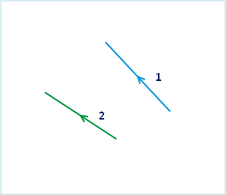

---
id: JoinLine
title: 连接线对象  
---  
在可编辑状态下，将两个或多个简单线对象连接成一个线对象。

### 使用说明

  * 连接线对象功能适用于二维线图层和 CAD 图层。
  * 连接线对象功能只有在选中线对象时可用。
  * 此操作不适用于复杂对象和复合对象。关于对象类型的介绍，请参考[对象绘制概述](../CreateObjects/AboutCreateGeometry)。
  * 应用程序提供连接方式：首尾相连和邻近点相连。不同的连接方式决定了连接后线对象的方向有所不同。 

**首尾相连** ：按照线的顺序（线对象的选择顺序或者 SMID
次序）将起点和终点依次连接，即将第一条线对象的终点与第二条线对象的起点相连，第二条线的终点与下一条线的起点相连，其他依次类推。连接后生成的线的方向与第一条线对象的方向相同。

**邻近点相连**
：连接的时候不考虑线的起止点，按照线对象端点之间距离远近判断，将第一条线的端点与距离最近的线对象的端点进行连接。连接后生成的线的方向与第一条线对象的方向相同。

如下图所示，线对象1和线对象2（图1）按照不同的连接方式进行连接的结果（图2和图3）：

  * 线对象的顺序说明。在对象首尾相连时，需要确定待连接线对象的次序，以确定线的方向。应用程序有两种方式确定待连接的线对象的顺序。一种是按住 Shift 键选择多条线对象，连接的时候线对象按照选择顺序进行连接；另外一种是通过鼠标框选，按所选择的线对象的 SMID 升序进行连接。 

### 操作步骤

  1. 在图层可编辑状态下，选择一个或多个要连接的线对象。 
  2. 在“ **对象操作** ”选项卡的“ **对象编辑** ”组的 Gallery 控件中，单击“ **编辑端点** ”分组中的“ **连接线** ”按钮，执行连接线操作。
  3. 弹出“连接线对象”对话框，在此对话框中设置连接完成后新对象的属性。

在“连接线对象”对话框中，既可以为每个字段分别设置操作方式，也可以同时选中多个字段统一进行设置。下面是对该对话框的说明。

  * **可编辑图层：** 可编辑图层下拉列表中列出了当前地图中所有的可编辑图层。可通过单击其右侧的下拉箭头，选择要操作的图层。
  * **连接方式** ：选择线对象的连接方式。支持两种连接方式：首尾相连和邻近点相连。关于这两种连接方式的介绍请参见 **使用说明** 中的介绍。
  * **字段列表区** ：该区域列出了当前可编辑图层中所有非系统字段和可编辑的系统字段的信息，包括字段名称、字段类型以及连接操作完成后，新对象字段的操作方式。默认使用第一个对象的字段属性。
  * **操作方式设置区** ：提供了四种操作方式。 
    * **为空** ：指连接完成后新对象此字段的值为空。
    * **求和** ：指连接完成后新对象此字段的值为各个连接对象相应字段值的和。
    * **加权平均** ：指连接完成后新对象此字段的值为所有连接对象此字段的加权平均值。需要指定加权字段。若不选择加权字段，则计算其简单的平均值，就是将所有源对象的选中字段值相加然后除以源对象的个数。
    * **保存对象** ：指连接完成后新对象此字段的值与当前某一个选择对象的此字段值相同。可以单击右侧的下拉箭头，选择新对象要使用的对象属性值。
4. 单击“确定”按钮，完成线对象连接操作。
