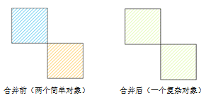

---
id: Merge
title: 合并  
---  
实际应用中，我们可能需要对对象进行合并操作。例如：当我们想在全国行政区划图上把黑龙江、吉林、辽宁三省合并为东北区，则可以选中东北三省三个面对象，使用合并运算，合成东北区。

合并支持面对象和线对象，若合并对象为线对象，只有当线之间有重合节点或线段时，才可合并成功。

### 使用说明

在进行合并操作时，还会出现多种特殊情况，下面对这些情况分别进行说明。

1. **当前图层为面图层**
* 如果参与对象运算的面相交于点，则这些面对象被合并成一个复杂面对象（如下图为生成一个具有两个子对象的复杂面对象）。    
  
---  
* 如果参与对象运算的面相交于线，则这些面对象间的相邻边线将消失，合并成一个简单面对象。  
    
---  
* 如果参与对象运算的面相交于面，则重新合并成一个简单面对象。   
   
---  
* 如果参与对象运算的面不相交，彼此不相邻，则合并后会生成一个复杂面对象（如下图为生成一个具有三个子对象的复杂面对象）。   
   
---  
2. **当前图层为复合图层**
* 在 CAD 图层中，线对象、曲线对象、椭圆弧对象、圆弧对象参与运算后，生成的新对象的类型为线对象；面对象、矩形对象、圆对象、斜椭圆对象参与运算后，生成的新对象的类型为面对象。
3. **跨图层合并**
* 跨图层合并时，其他图层的选中的对象都会与当前可编辑图层中的对象进行合并运算。操作后只有当前可编辑图层的对象发生改变，其他图层的对象不会发生变化。在开启多图层编辑时，需要选择对哪个可编辑图层中的对象进行合并操作。

### 操作步骤

1. 在图层可编辑状态下，选中两个或者多个对象。
2. 在“ **对象操作** ”选项卡的“ **对象编辑** ”组的 Gallery 控件中，单击“ **合并** ”按钮，弹出“合并”对话框。
3. 在对话框中，设置要保留的对象。关于对象合并属性处理对话框及对话框上各参数的说明，请参见[属性处理对话框说明](AttributeDiag)。
4. 单击“确定”按钮，完成对象的合并。

###  相关主题

 [组合](Group)

 [对象编辑概述](AboutEdittingGeometry)

