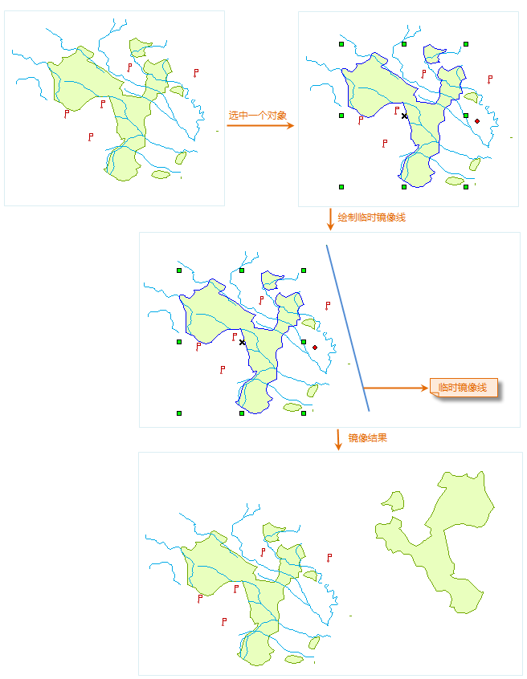
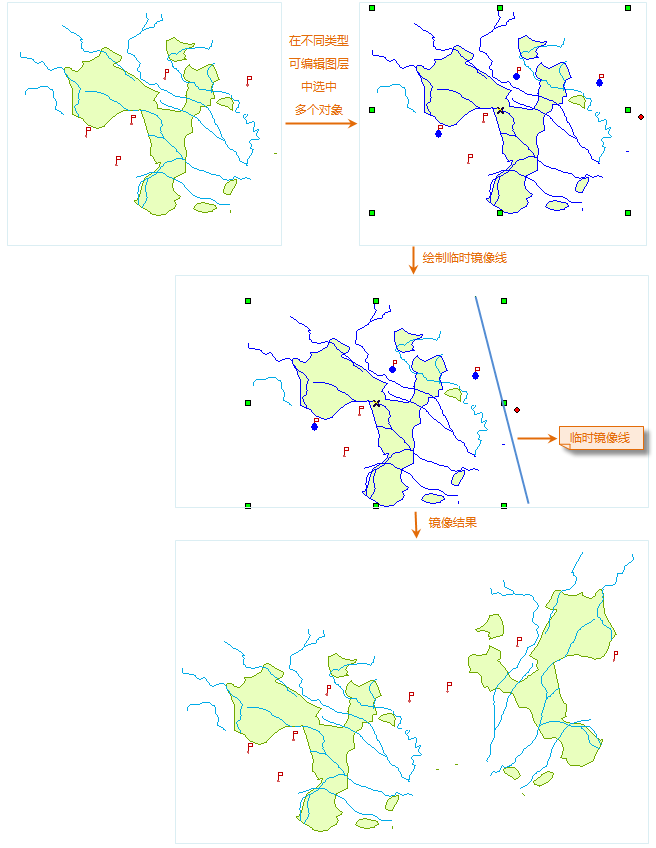

---
id: Mirror
title: 镜像  
---  
### 使用说明

“镜像”按钮提供了绕指定的临时镜像线翻转选中的几何对象（非文本几何对象）来创建对称的镜像对象，选中的原几何对象保持不变，所创建的镜像对象为选中的原几何对象的副本，其与选中的原几何对象的位置关系为：所创建的镜像对象为选中的原几何对象绕指定的临时镜像线翻后所得的效果。

### 操作步骤

  1. 在可编辑图层中，选中要进行镜像操作的几何对象（非文本几何对象）。可以同时按住 Shift 或者 Ctrl 键，连续选中多个几何对象或者使用拖框选择的方式选中多个几何对象。
  2. 在“ **对象操作** ”选项卡上的“ **对象编辑** ”组的 Gallery 控件中，单击“ **镜像** ”按钮，执行镜像操作。
  3. 此时鼠标提示：“请绘制镜像参考线”，即可绘制临时镜像线，具体操作为：在适当位置处点击鼠标左键确定镜像线的第一个点，移动鼠标，经出现随鼠标移动而不断变化的临时线段，在适当位置处点击鼠标右键确定镜像线的另一个点（最后一个点），程序执行镜像操作。所确定的线段即为选中的几何对象绕其旋转的临时镜像线。
  4. 要进行下一次的镜像操作，重复上面第 1 步到第 3 步的操作。

  
---  
图：镜像操作图示 1  
  
### 注意事项

当启动了多图层编辑时，用户可以同时选中多个可编辑图层中的多个不同类型几何对象（非文本几何对象）来进行镜像操作，如下面的示意图所示。

  
---  
图：镜像操作图示 2  
  

