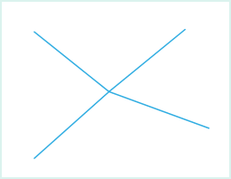

---
id: NodeAdjust
title: 点平差  
---  
点平差功能可以实现相邻线的连接。点平差时对平差范围内（通过圈选确定）的全部节点进行平差计算，平差结果将产生一个新的节点，删除圈选的所有节点，在新节点处连接线对象。注意：连接仅是在节点处连接，并不是形成一个对象。

如下图所示，选中相邻的四条线的端点（蓝色圆圈内的节点），对其进行平差操作，平差的结果是将四条线对象选中的节点全部删除，平差计算得到新节点，并将其与四条线上的其他节点分别相接，得到的结果如下图所示：

 |   
---|---  
圈选参与操作的节点 | 点平差结果  
  
### 使用说明

  * 点平差功能适用于线图层和 CAD 图层。
  * 当圈选范围较大时，点平差操作对完全落入临时绘制的圆范围内的线对象不进行处理。

### 操作步骤

  1. 在图层可编辑状态下，在“ **对象操作** ”选项卡上的“ **对象编辑** ”组的 Gallery 控件中，单击“ **点平差** ”按钮，执行点平差操作。
  2. 将鼠标移至地图窗口中，提示“鼠标圈选要平差的线的节点”。在地图窗口中绘制一个临时圆，使参与平差操作的节点恰好落入圆中。
  3. 单击鼠标左键，对选中的节点进行平差操作。
  4. 单击鼠标右键，即可取消当前操作。

