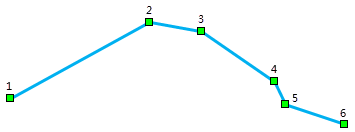
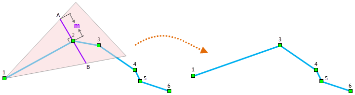
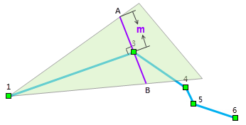
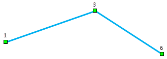
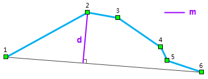
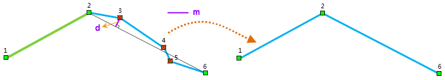
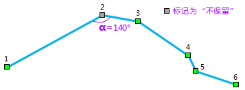
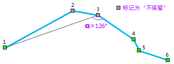
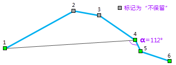
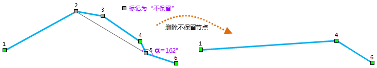

---
id: ReSampleIntro
title: 线状对象重采样说明  
---  
线状对象重采样是指对线几何对象或者面几何对象的边界线进行重采样，根据一定的规则去掉几何对象上一些的节点，同时，尽量保持几何对象的形状。

当前 SuperMap UGC(Universal GIS
Class)系列产品中针对矢量数据集中的线状对象提供的重采样方法有三种，分别是“光栏法”、“道格拉斯-普克法”和“角度法”

### 一、使用 **光栏法** 进行重采样

  1. 下面以下图所示的有 6 个节点的折线为例来说明光栏法的计算过程：

  2. 如下图（左）所示，在节点2处做线段12的垂线，在垂线上选择距离节点2点为“重采样距离 m ”的 A、B 两点，分别连接节点1和 A、B 两点并继续延伸形成重采样区域（左图中的粉色区域），判断节点3是否在该区域内。如果在该区域内，则删除节点2；否则保留。 由于节点3在重采样区域内，所以节点2被删除，折线变成下图（右）所示的形状。

  3. 然后，按照步骤1中的方法判断节点3。如下图所示，得知节点4不在重采样区域内（绿色区域），因此节点3被保留。

  4. 继续对剩余节点进行判断，最终得到如下图所示的重采样结果。

### 二、使用 **道格拉斯-普克法** 进行重采样

下面仍然使用光栏法中使用的有 6 个节点的折线为例来说明道格拉斯-普克法的计算过程：

如下图所示，将折线的首尾节点相连，得到一条连线，其他节点到这条线的距离的最大值为 d，如果 d > m(重采样容限)，则 d
所对应的节点保留，并以该节点为分界点，将原线对象划分为两部分，分别继续使用该方法进行重采样，直到所有划分出来的线都不能再进行重采样（即仅包含两个节点）；否则所有中间节点均被删除。

  1. 下图中，显然有 d > m，因此，节点 2 保留，原线对象划分为两部分，分别包含节点1、2和2、3、4、5、6。

  2. 如下图（左）所示，由节点1、2构成的线不能再简化。对由节点2、3、4、5、6构成的线重复上一步骤，由于 d < m，因此节点2和6之间的节点均被删除，剩余节点2和6，因此不能再继续简化，从而得到下图（右）所示的重采样最终结果。

### 三、使用 **角度法** 进行采样法

角度法的核心是判断三点的夹角α与重采样角度d是否满足这样一个关系：180-d > α > d。

假设线有 n 个节点，构成夹角的第一个点为线的第 i（i≥1）个节点，构成夹角的第二个点（待判断是否保留的节点）为线的第 j（j≥2）个点，第三个点为线的第
k（k=j+1）个节点。节点 i、j、k 构成的夹角为 α（取较小夹角）。

如果 α 不满足上述关系，那么节点 j 将被标记为“不保留”，i 不变，而 j 和 k 加1，即下一轮判断中构成夹角的三个节点顺次为：i、j+1、k+1；

如果 α 满足上述的关系，系统将第 j 个节点标记为“保留”，然后下一轮判断中，构成夹角的三个节点顺次为第 i+1、j+1和k+1 个节点。

按照此规则，直到 k>n 时，判断结束，此时，将所有标记为“不保留”的节点剔除，就得到了重采样的结果。

下面仍然使用有 6 个节点的折线为例来说明 **角度法** 的计算过程。假设重采样角度为60度，那么判断条件为：120>α>60。

  1. 首先，判断节点1、2、3的夹角是否满足条件，即判断节点2是否保留。该夹角 α 为140度，不满足判断条件，因此节点2标记为“不保留”，按规则，下一步将判断节点1、3、4的夹角是否满足条件。

  2. 如下图所示，节点1、3、4的夹角为126度，不满足判断条件，因此节点3被标记为“不保留”，按规则，下一步将判断节点1、4、5的夹角。

  3. 如下图所示，节点1、4、5的夹角为112度，满足判断条件，因此节点4被标记为“保留”，按规则，下一步判断节点2、5、6的夹角。

  4. 如下图（左）所示，节点2、5、6的夹角为162度，不满足判断条件，因此节点5被标记为“不保留”。按规则，下一步应判断节点2、6、7，节点7不存在，因此判断结束。将标记为“不保留”的节点删除，得到下图（右）所示的重采样结果。

  

