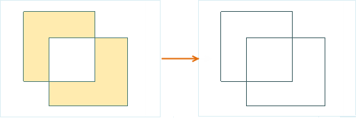
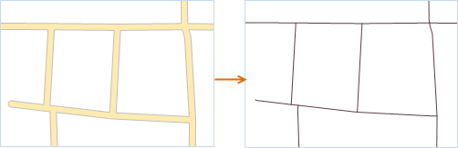

---
id: RegionToLine
title: 面对象转线对象  
---  
### 使用说明

面对象转线对象功能，支持将选中面对象的边界线或中心线转换成线对象，并保存在线数据集或CAD数据集中。面对象转换成线对象时，支持轮廓线和中心线两种方式的转换，如下图所示：

  
---  
图1：面轮廓线转为线对象  
  
图2：面中心线转为线对象  

### 操作步骤

1. 将面数据集打开到地图中，在当前面图层可选择状态下，选中一个或多个面对象。
2. 在“ **对象操作** ”选项卡的“ **对象编辑** ”组的 Gallery 控件中，单击“面->线”按钮，弹出“面对象->线对象”对话框。 
3. 在对话框中选择存放新生成线对象的目标数据源与数据集，结果数据的保存方式有两种：保存到已有的数据集或新建一个线数据集来保存。对话框中的参数设置如下： 
  * **目标数据源** ：设置结果数据集所要保存在的数据源。
  * **目标数据集** ：选择已存在的线或CAD数据集，用于存放新生成的线对象。
  * **新建数据集** ：勾选“新建数据集”复选框，设置新建数据集的名称，将新生成的线对象保存到新建线数据集中。如若不勾选该复选框，新生成的线对象将存放在目标数据集中，其属性字段也将追加在目标数据集属性表中。
4. **面转线类型** ：单击组合框右侧下拉按钮，可选择面转线的类型，提供了提取边界线和中心线两种转换方式： 
  * 提取边界线：该类型的转换方式是指将面对象的边界线转为线对象。
  * 提取中心线：该类型的转换方式是指将面对象的中心线转为线对象。选择提取中心线方式时，需设置最大宽度和最小宽度值，面对象宽度在最大最小宽度值之间的提取其中心线，面对象宽度小于最小宽度则不提取中心线，面对象宽度大于最大宽度时提取边界线，具体说明可参见[面提取中心线](../../Vector/RegionToCenterLine.html)页面。
5. **删除源对象** ：若选中面对象所在图层为可编辑状态，则可勾选“删除源对象”复选框，在源数据集中将选中对象删除。
6. 单击“确定”按钮，完成面对象转换为线对象操作。

### 注意事项

1. 一个面对象生成一个线对象，组合的面对象生成组合的线对象。
2. CAD 中的由多个面组合而成的复合对象，不支持通过该功能转换为线对象。

