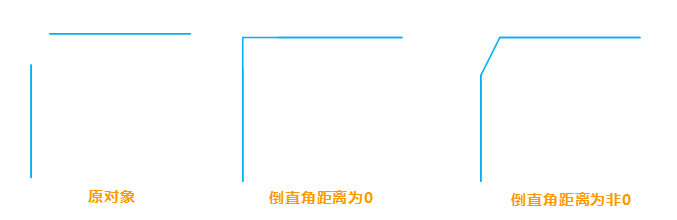
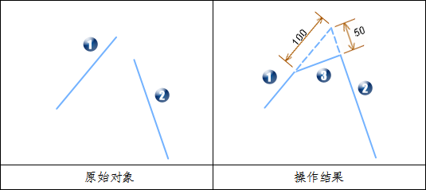
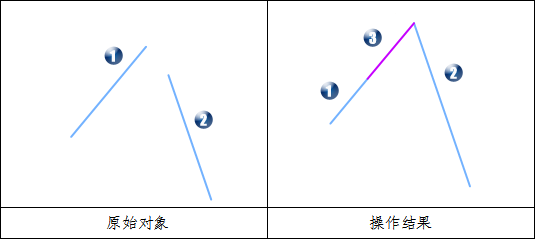
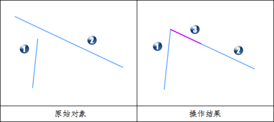
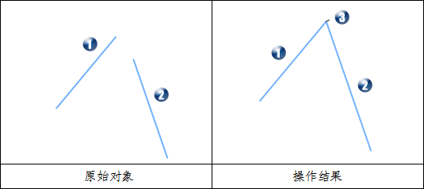
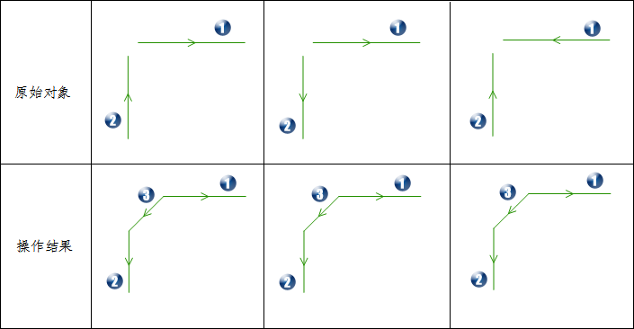

---
id: ReverseRightAngle
title: 生成倒直角  
---  
“ **对象操作** ”选项卡上的“ **对象编辑** ”组的“ **倒直角**
”命令，提供了生成倒直角的功能。倒直角和倒圆角类似，都是将两个对象进行连接。倒圆角以光滑的弧线相接，而倒直角则以平角相接。生成倒角的意义，使原本尖锐的直线之间的夹角，看起来更加美观，更加圆滑，更符合实际需要。

对两条线段的邻近端点延伸或修剪，最终连接形成倒角。如下图所示，当两个倒角距离都为0时，会将两条直线修剪或者延长直至它们相交，当两个倒角距离均不为0时，会按照指定的距离对两条线段进行延长，然后将两条直线连接。

  

  
### 使用说明

  * 只有在可编辑的图层中选中两条线段时，“倒直角”按钮才可用，即该功能只对选中的两条线段有效。
  * 参与生成倒直角的对象必须为简单线对象，且其延长线有且仅有一个交点。如果两条直线相互平行或在同一条直线上，则操作不成功。
  * 完成操作后，源直线可能会发生延伸、修剪，而属性信息不会发生变化。 
  * 倒角距离参数说明：在生成倒直角时，对两个距离参数有严格的限制。距离参数的取值范围为两条直线的交点到最远端点的距离。对于超出此长度的参数，应用程序会给出错误提示。
  * 对于交叉线虽然能进行倒角操作，但没有明显地学意义，故对于此情况不详细介绍。

### 操作步骤

  1. 设置要生成倒直角的线段对象所在的图层为当前可编辑图层。
  2. 在图层中同时选中两条线段对象（非平行线）。
  3. 在“ **对象操作** ”选项卡的“ **对象编辑** ”组的 Gallery 控件中，单击“ **倒直角** ”按钮，弹出“倒直角参数设置”对话框。在弹出对话框中分别输入到第一条直线和第二条直线的距离。默认到第一条直线和到第二条直线的距离均为0，此时会直接将两条直线在相交处相连。
    
  4. 设置是否修剪源对象。勾选该项表示，执行操作后会源对象进行修剪操作，否则将保留原始对象。
  5. 在地图窗口中会实时显示生成倒直角的预览效果。单击“确定”按钮，根据用户的设置执行生成倒直角的操作。

### 备注
 **参数说明**

**第一条线倒角距离** ：第一条线被修剪或者延伸后，两条线的延长线交点到第一条线最近端点的距离。 如下右图所示，第一条线倒角距离为100。

**第二条线倒角距离** ：第二条线被修剪或者延伸后，两条线的延长线交点到第二条线最近端点的距离。如下右图所示，第二条线倒角距离为50。

  
---  
  
**图片说明**

（1）1表示第一条直线，2表示第二条直线，3表示新生成的倒角线。

（2）第一条直线被修剪，第二条直线被延伸。

  * **距离有效范围说明**

距离的最小值为0；最大值为两条线交点至各自最远端点的距离。如果大于此值操作，则输出窗口会提示：输入的距离值太大，倒直角失败！。

如果距离为0，则倒角线会有些特殊的变化，具体见下表图示和说明。

第一条线倒角距离 | 第二条线倒角距离 | 图示 | 说明  
 ---|---|---|---  
0 | 非零 |  |第一条直线被延伸至两条线的交点处。第二条直线被修剪。新生成的倒角线位于结果中第一条直线的延伸线上，长度为第一条线的倒角距离。  
非零 | 0 |  |第一条直线被修剪。第二条直线被延伸至两条线的交点处。新生成的倒角线位于结果中第二条直线的延伸线上，长度为第二条线的倒角距离。  
 0 | 0 |  |第一条直线和第二条直线被延伸至两条线的交点处。新生成的倒角线位于交点处，为一个长度为0的假直线。  
* **方向说明**   
完成操作后，源直线的方向会发生变化，具体见下图示和说明。

     
  
   **图片说明**

（1）1表示第一条直线，2表示第二条直线，3表示新生成的倒角线。  
（2）新生成的倒角线的方向为由第一条直线向第二条直线方向。  
（3）第一条直线的方向变化为与新生成的倒角线相反。  
（4）第二条直线的方向变化为与新生成的倒角线相同。
