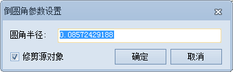
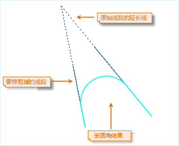
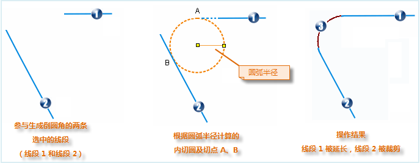

---
id: ReverseRoundAngle
title: 生成倒圆角  
---  

“ **对象操作** ”选项卡上的“ **对象编辑** ”组的“ **倒圆角**”命令，提供了生成倒圆角的功能，即对两条线段的邻近端点延伸或修剪，以一个与两条线均相切的圆弧连接形成圆角。

> ### 使用说明

* 只有在可编辑的图层中选中两条线段时，“倒圆角”按钮才可用，即该功能只对选中的两条线段有效。

* 参与生成倒圆角的对象必须为简单线对象，且其延长线有且仅有一个交点。如果两条直线相互平行或在同一条直线上，则操作不成功。

* 完成操作后，源直线可能会发生延伸、修剪，而属性信息不会发生变化。  
* 对于交叉线虽然能进行倒角操作，但没有明显地学意义，故对于此情况不详细介绍。

 ### 操作步骤

1. 设置要生成倒圆角的线段对象所在的图层为当前可编辑图层。

2. 在图层中同时选中两条线段对象（非平行线）。

3. 在“ **对象操作** ”选项卡的“ **对象编辑** ”组的 Gallery 控件中，单击“ **倒圆角**
”按钮，弹出“倒圆角参数设置”对话框。默认圆角半径取两条线段最大内切圆半径的五分之一。圆角半径的单位与当前可编辑图层的坐标单位保持一致。  

4. 设置圆弧半径，即与两条线均相切的圆弧半径，生成倒圆角的结果将根据用户设置的圆弧半径，来决定倒圆角的生成位置和大小，从而会对参与操作的两条线段进行适当的延伸或裁剪。随着圆弧半径的修改，预览图会实时的显示倒圆角操作结果，方便用户进行调整。

5. 设置是否修剪源对象。勾选该项表示，执行操作后会源对象进行修剪操作，否则将保留原始对象。  
  
 
6. 在地图窗口中会实时显示生成倒圆角的预览效果。单击“确定”按钮，根据用户的设置执行生成倒圆角的操作，结果如下图所示。  
  

7. 操作结果说明：系统在选中的两段线中计算出半径为输入半径的内切圆，并找到两段线上各自在内切圆的切点，如果切点在线段上，将把它截掉；如果在延长线上，则将线段的端点延伸到切点后，在内切圆中取两切点之间的外圆弧，生成新的线对象，其属性记录加到属性表尾部，系统字段由系统赋值，非系统字段值为空，而原线对象保留原属性。
操作结果图示说明如下：    
  

