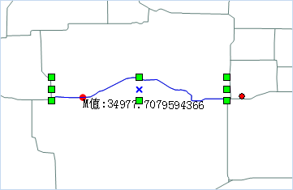
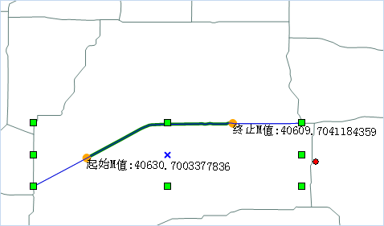

 ### 使用说明

 “根据M值添加点/高亮线段”功能，可为选中路由线对象添加一个特定M值的节点；同时可根据起始和终止M值，在图层上高亮显示两个M值之间的路由线段。

 ### 操作步骤

1. 将路由数据添加到地图窗口中，将该图层设置为可编辑状态，选中一个需添加点的路由对象。

2. 在“ **对象操作** ”选项卡的“ **对象编辑** ”组的 Gallery 控件中，单击“ **根据M值添加点/高亮线段**
”按钮，弹出“根据M值添加点/高亮线段”窗口。
3. 勾选“添加点”复选框，可在路由线对象上添加指定M值的节点，添加方式有以下两种：  

* 在编辑框中输入一个M值，例如输入100，则该路由线M值为100处的点将在地图上高亮显示，单击“添加”按钮，则在该路由线对象上增加一个M值为100的节点。
* 单击“M值”组合框右侧的按钮，将鼠标移至选中的路由对象处，会显示鼠标所在位置的M值和坐标信息，在合适位置单击鼠标后，单击对话框中的“添加”按钮，即可将该点添加到选中的路由对象上。  
   
4. 勾选“高亮线”复选框，在起始M值和终止M值数值框中输入M值，或者单击 
按钮，在地图窗口选中的路由线对象上拾取合适的M值位置，分别作为起始M值和终止M值，则位于这两个M值之间的路由线段会在地图中高亮显示。如下图所示：
   
5. 单击“关闭”按钮，将当前对话框关闭，完成添加点或高亮线的显示。

 ###  注意事项
添加点处输入的M值必须在选中路由对象的最小、最大M值之间；高亮线处的起始M值和终止M值的值域，为选中路由对象的最小M值至最大M值。
