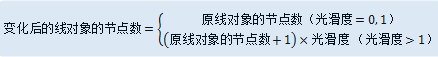

---
id: SmoothGeometry
title: 光滑  
---  
 “ **对象操作** ”选项卡上的“ **对象编辑**
”组提供了处理线几何对象或面几何对的边界线的功能。曲线光滑功能主要对线几何对象或面几何对象的边界线进行平滑处理，使折线转变成连续的光滑线对象。

 “ **对象编辑** ”组中的控件只有在地图窗口中有选中的可编辑图层中的几何对象（线几何对象和面几何对象）时才可用。

 ### 使用说明

   * “曲线光滑”按钮用来对当前地图窗口中选中的可编辑图层中的线几何对象或面几何对象的边界线进行平滑处理。

   * 光滑度表示让原有线对象变得更为光滑的程度，该参数值与变化后的线对象的节点数成正比。其值类型为整数，取值范围为0-2147483647。光滑度与节点的具体关系如下所示： 
   
  
 
   * 关于曲线光滑的原理及结果说明，请参见：[光滑方法说明](../../Vector/SmoothMeth)。

   * 参与光滑处理的线对象必须是具有3个以上（含3个）节点的线对象。因为两点直线就是一个光滑的线，无需光滑处理。

 ### 操作步骤

   1. 将地图窗口中要进行平滑的几何对象（线几何对象或面几何对象）所在的图层设置为可编辑状态。

   2. 选中要进行平滑的几何对象（线几何对象或面几何对象），可以同时按住 Shift 或者 Ctrl 键，连续选中多个几何对象。

   3. 在“ **对象操作** ”选项卡的“ **对象编辑** ”组中的 Gallery 控件中，单击“ **光滑**
”按钮，弹出“曲线光滑系数设置”对话框。

   4. 在“光滑系数”右侧的文本框中输入曲线平滑度的数值，默认值为4。

   5. 要平滑地图窗口中其他图层中的几何对象，重复上面第 1 步到第 4 步的操作。

   6. 单击“确定”按钮，完成对选中对象的曲线光滑处理。

 ### 注意事项

 当启动了多图层编辑时，用户可以同时选中多个可编辑图层中的多个线几何对象和面几何对象来进行重采样或者曲线光滑操作。

