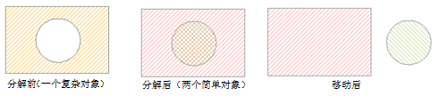

---
id: UnGroup
title: 分解  
---  
 将一个或多个复杂对象或复合对象进行分解。分解的结果可以是单一对象，也可以是复杂对象。

 ### 使用说明

   * 分解功能适用于线图层、面图层、文本图层以及 CAD 图层。

   * 只能对复杂对象或者复合对象进行分解，简单对象不能被分解。

   *
对复杂对象（即含有多个子对象的非文本对象）进行分解，生成的多个单一对象均为简单对象；对复合对象进行分解，生成多个单一对象，如果生成的单一对象中仍有复合对象则可以继续对其进行分解，直至全为简单对象。

 如下图所示为一个岛洞多边形，对它进行分解操作之后，得到的新对象为两个单一的对象：

   
 ---  
 图：分解复杂对象  
   * 对文本对象进行分解，可以生成的新对象的属性信息中字段 SmUserID 和非系统字段继承源对象相应信息，其他系统字段由系统赋值。

 ### 操作步骤

   1