---
id: UpdatePartly
title: 局部更新  
---  
在可编辑状态下，用绘制的折线更新线对象或者面对象的部分。局部更新功能可以使用该折线与源对象（待更新的线对象）相交的部分形成新的对象。

### 使用说明

* 局部更新功能适用于线图层、面图层以及 CAD 图层。

* 在未选中待更新对象时，绘制的折线的起始点和终点必须在待更新对象的边界上，所以在操作时建议打开捕捉功能。

* 若选中待更新对象，可用裁剪方式进行更新，绘制的折线与待更新对象至少需有两个交点。

* 参与局部更新对象可以是简单对象或复杂对象的单个子对象，但不能是复合对象。

图1为待更新的线对象，用图2中绘制的折线对其进行更新，折线的起止点都需在线对象上，图2中高亮加粗显示的线段为局部更新的结果。

绘制的更新线段，将待更新线对象分割为三段。确定更新折线的起止点后，若按下键盘快捷键
Ctrl或者shift，可切换局部更新结果，如图3中高亮加粗显示的线段。

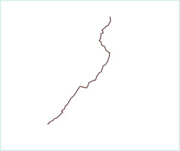 | 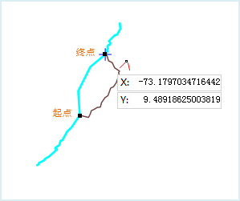 | 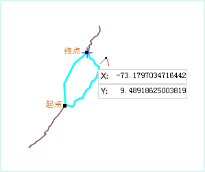  
---|---|---  
图1：待更新的对象 | 图2：局部更新操作 | 图3：切换局部更新结果  
* **待更新对象为选中的线对象（裁剪模式）**

如下图所示，为一段不封闭且选中的线对象的局部更新情况示意图。

图1为待更新的线对象，用图2中绘制的折线对其进行更新，绘制的折线与待更新线对象有两个或以上交点即可，图2中高亮加粗显示的线段为局部更新的结果。

绘制的更新线段，将待更新线对象分割为三段。确定更新折线的起止点后，若按下键盘快捷键
Ctrl或者shift，可切换局部更新结果，如图3中高亮加粗显示的线段。

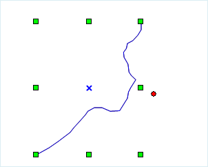 | 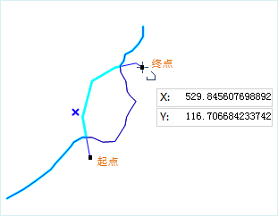 | 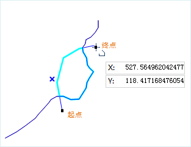  
---|---|---  
图4：待更新的对象 | 图5：局部更新操作 | 图6：切换局部更新结果  

* **待更新对象为未选中的面对象（捕捉模式）**

如下图所示，为封闭且未选中面对象的局部更新示意图。

确定更新折线的起止点在面对象的边界线上，更新结果预览效果为蓝色区域（图8），同时更新面对象边界线以高亮加粗显示；若按下 Ctrl 或者
Shift键，将自动切换更新结果，如图9高亮加粗线段之间的蓝色区域所示。

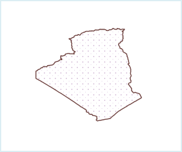 | 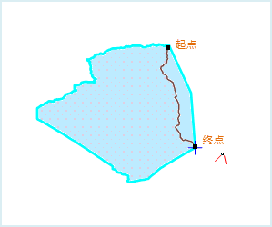 | 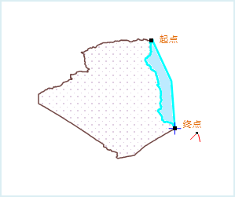  
---|---|---  
图7：待更新的封闭面对象 | 图8：局部更新结果1 | 图9：局部更新结果2  
* **待更新对象为选中对象（裁剪模式）**

如下图所示，为封闭的已选中面对象的局部更新示意图。

更新折线的起止点可在面对象边界线内，或者边界线外，绘制的折线需与面对象边界线有两个或以上的交点。更新结果预览效果为蓝色区域（图11）同时更新面对象边界线以高亮加粗显示；若按下
Ctrl 或者 Shift键，将自动切换更新结果，如图12高亮加粗线段之间的蓝色区域所示。

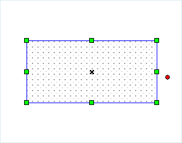 | 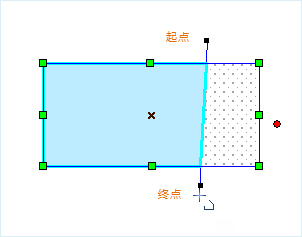 | 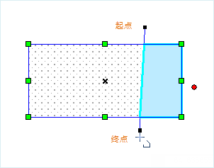  
---|---|---  
图10：待更新的封闭面对象 | 图11：局部更新结果1 | 图12：局部更新结果2  

### 操作步骤

1. 在“图层管理器”中，将图层设置为可编辑状态。

2. 在“ **对象操作** ”选项卡的“ **对象编辑** ”组的 Gallery 控件中，单击“ **局部更新**
”按钮，执行局部更新操作。此时，地图窗口中将出现折线光标。

3. 局部更新有两种操作方式，即捕捉模式和裁剪模式。待更新对象是否选中的操作方式有所不同，若未选中待更新对象，只能使用捕捉模式进行更新；若以选中待更新对象，则可用捕捉模式或裁剪模式进行更新。

* **捕捉模式**：将折线光标移至待更新的线对象或面对象边界上，绘制的起点和终点必须在待更新对象的边界上，如果不在其边界上，则输出窗口中会提示：“以捕捉模式进行更新，需要点在线上，若要以裁剪模式进行更新，请先选中一个对象。”，需要重新绘制起点。若绘制折线的起点捕捉到线上，一定是捕捉模式。

* **裁剪模式**：选中待更新对象，绘制的起点可在待更新对象的边界上，或不在边界上，但绘制的折线需与线对象或者面对象的边界线有两个或以上的交点。

4. 继续绘制折线。当绘制的点捕捉到待更新对象上时，会自动高亮显示更新后的形状。当前绘制的折线会把待更新对象的边界分割成多段，按住 Ctrl 或者 Shift 键可以切换选择要更新的边界。

5. 单击鼠标右键，确定用当前绘制的形状进行更新，完成局部更新操作。

