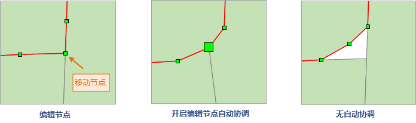

---
id: VertexEdit
title: 编辑几何对象的节点  
---  
“ **对象操作** ”选项卡的“ **对象编辑**
”组提供了对几何对象的节点进行编辑的功能，包括：“添加节点”和“编辑节点”功能，从而通过编辑几何对象的节点来改变几何对象的形状和位置。

节点（vertex）表示用来描述 SupeMap 中几何对象的一系列坐标点。SupeMap 中文本几何对象不具有节点。

注意：节点编辑功能只对线、面对象可用，其它对象（如椭圆对象、圆弧对象等）则无法使用该功能。选中某一对象后，单击鼠标右键，在弹出的右键菜单中选择“属性”项，可在属性对话框的节点信息中查看所选对象的对象类型。

* **编辑节点**

当“编辑节点”按钮处于按下状态时，在地图窗口中的可编辑图层中，可以编辑当前选中的几何对象的节点，主要包括移动节点和删除节点。

具体操作步骤为：

1. 将地图窗口中要编辑节点的几何对象（线几何对象或面几何对象）所在的图层设置为可编辑状态。

2. 选中一个要编辑的几何对象（线几何对象或面几何对象），并且当前只能对一个选中的对象进行编辑节点的操作。

3. 在“ **对象操作** ”选项卡的“ **对象编辑** ”中，单击“ **编辑节点**
”按钮，使其处于按下状态，此时，当前地图窗口中的操作状态变为编辑节点状态，并且选中的几何对象将显示出所有的节点。

4. 移动节点：选中几何对象上的某个节点。在该节点上单击鼠标左键即可选中这个节点，在选中的节点上按住鼠标左键不放，同时拖动鼠标，
即可实现选中节点的移动，移动完成后，松开鼠标左键即可。以同样的方式进行其他节点的移动，移动节点后几何对象的形状会随之发生改变。

5. 删除节点：选中几何对象上的某个节点，可以同时按住 Shift 或者 Ctrl 键，连续选中多个节点，然后，按 Delete
键，即可删除所选中的节点， 删除节点后几何对象的形状会随之发生改变。

6. 在操作过程中，用户可以选择其他几何对象，选中的几何对象仍将显示其所有节点，用户可以继续进行节点的移动和删除编辑操作，直到用户将“编辑节点”按钮切换为非按下状态，编辑节点操作状态才会终止；

7. 取消当前地图窗口的编辑节点操作，只需单击“编辑节点”按钮，使其处于非按下状态。

8. 要编辑地图窗口中其他图层中的几何对象节点，重复上面第 1 步到第 7 步的操作。

* **编辑节点自动协调** ：当用户在对线数据集及面数据集进行编辑节点的操作时，可以开启“编辑节点自动协调”，当开启该功能后：

* 当对相邻多个面对象的公共节点进行拖动、删除操作时，相邻接的面对象会自动维护临边关系，避免了重复调整相邻对象的节点和容易出现缝隙或重合的拓扑问题，并提高了用户的工作效率。

* 当对相邻多个线对象的公共点进行拖动、删除操作时，共用该点的线对象会自动按照移动后的节点位置重新调整线型，避免了用户重复移动公共点和容易出现移动后点位不能重合的问题。

  
---  

具体操作步骤为：

1. 在“ **对象操作** ”选项卡的“ **对象绘制**
”组的“绘制设置”中，单击“编辑节点自动协调”按钮，使其处于选中状态，此时，编辑节点时会开启自动协调。

2. 将鼠标移至地图窗口选中需要调整的节点，并按住鼠标左键移动鼠标，或者按 Delete
可删除该节点。编辑节点之后，相邻面对象的几何形状会发生改变，并且始终保持邻接关系。编辑多个线对象的公共点，共用该点的线对象会自动按照移动后的节点位置或删除后的状态重新调整线型。

3. 停止自动协调需取消“编辑节点自动协调”的选中状态，自动协调编辑操作状态才会终止。

* **添加节点**

当“添加节点”按钮处于按下状态时，在地图窗口中的可编辑图层中，可以为当前选中的几何对象添加新的节点。

具体操作步骤为：

1. 将地图窗口中要添加节点的几何对象（线几何对象或面几何对象）所在的图层设置为可编辑状态。

2. 选中一个要添加节点的几何对象（线几何对象或面几何对象），并且当前只能对一个选中的对象进行添加节点的操作。

3. 在“ **对象操作** ”选项卡的“ **对象编辑** ”中，单击“ **添加节点**
”按钮，使其处于按下状态，此时，当前地图窗口中的操作状态变为添加节点状态，并且选中的几何对象将显示出所有的节点。

4. 在几何对象边界线上的任意位置处单击鼠标左键，即可在鼠标单击处添加一个新的结点，以此方式在几何对象边界线上的其他位置处添加节点。

5. 在操作过程中，用户可以选择其他几何对象，选中的几何对象仍将显示其所有节点，用户可以继续进行添加节点的操作，
直到用户将“添加节点”按钮切换为非按下状态，添加节点操作状态才会终止。

6. 取消当前地图窗口的添加节点操作，只需单击“添加节点”按钮，使其处于非按下状态。

7. 要为地图窗口中其他图层中的几何对象添加节点，重复上面第 1 步到第 6 步的操作。

