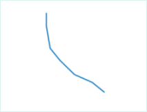

---
id: offset
title: 缩放  
---  
缩放功能是按照指定的缩放距离，创建一个形状与原对象形状比例不变的新对象。

### 使用说明

  * 缩放操作适用于线图层、面图层或者 CAD 图层。
  * 缩放操作既适用于简单对象，也适用于复杂对象。对于复杂对象，同时对复杂对象的每个子对象按照指定的缩放距离缩放。
  * CAD 图层中的参数化对象（如正多边形、扇形等）、复合对象不支持缩放。
  * 在输入偏移距离时，输入的距离值为正值，表示向上偏移；输入的距离值为负值，则表示向下偏移。

### 操作步骤

  1. 在“ **对象操作** ”选项卡的“ **对象编辑** ”组的 Gallery 控件中，单击“ **缩放** ”按钮，执行缩放操作。
  2. 根据输出窗口“选择要缩放的对象”的提示，选择一个对象（线对象或者面对象）作为缩放对象。
  3. 拖动光标，可以看到一个与被选对象形状平行的临时对象随着鼠标而移动。
  4. 将鼠标移动到合适的位置，单击左键，完成缩放操作。
  5. 如想精确缩放，在参数输入框中输入对象要缩放的距离，按 Enter 键完成操作。
  6. 如果要继续对选中对象继续缩放，重复第5、6步即可。
  7. 按 ESC 键或者单击鼠标右键结束操作。

如下图所示，为对象缩放前后的示意图。蓝色为源对象，红色会缩放后的对象。

 
  
### 备注

  * 缩放的结果会产生一个新对象，同时保留源对象。新产生的对象的非系统字段的属性与源对象的属性保持一致。
  * 如果在缩放过程中新生成对象有自交现象，则对于线对象，其缩放距离应小于缩放对象任意两点之间的距离；而对于简单面对象，其缩放距离应小于缩放对象任意两点之间的距离的一半。

