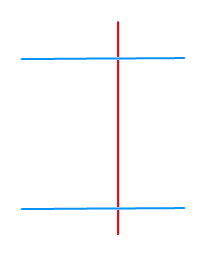
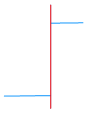

---
id: trim
title: 修剪  
---  
 修剪工具可以将选中一个线对象（基线）与其相交的选中的另外一个线对象（修剪对象）相交处修剪掉。

 ### 使用说明

   * 按基线对象定义的剪切边修剪对象。使用修剪工具时，应先选择用于修剪的线要素（基线），然后单击要修剪的相交线段。鼠标单击的部分将被移除，即被修剪掉。

   * 适用于修剪线图层的对象或者 CAD 图层的线对象。同时要求要修剪的对象所在的图层可编辑。

   * 修剪操作只对与基线相交的线对象有效，而对于不相交的线对象将不进行任何操作。

   * 待修剪对象必须为简单线对象；基线可以是复杂线对象或简单线对象，但不能是复合对象。

   * 当需要连续修剪与同一条线（基线）相交的多个线要素时，先选择一个线对象作为基线，然后连续修剪与基线相交的线对象即可。

 ### 操作步骤

   1. 在“ **对象操作** ”选项卡上的“ **对象编辑** ”组的 Gallery 控件中，单击“ **修剪**
”按钮，执行修剪操作。此时地图窗口中鼠标提示：请选择基线。

   2. 选择一条线对象作为基线，此时鼠标提示：请点击要修剪的线段。

   3. 选择想要修剪掉的线对象部分。

 修剪完成后，基线仍然保留，包含鼠标点击位置的线段部分将被删除。新对象的系统字段（除 SmUserID 外）由系统赋值，非系统字段和字段 SmUserID
保留修剪对象的相应属性。

  |   
 ---|---  
 线对象修剪前 | 线对象修剪后  

