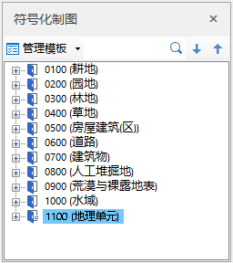

---
id: SymbolicMappingExample
title: 符号化制图示例  
---  
 ### 使用说明

 本专题文档主要以预定义国情普查模板为实例，介绍如何利用符号化模版进行制图。该模板是根据国家国情普查工作标准《GDPJ
03-2013地理国情普查数据规定与采集要求》制定的，定义了各类要素的数据集名称、数据集类型、显示风格、部分属性等。

 ### 操作步骤

1. 在“ **对象操作** ”选项卡的“ **对象绘制** ”组中，单击“ **符号化制图**
”按钮，工作空间右侧弹出”符号化制图“功能界面。

2. 在“ **符号化制图** ”功能界面的“ **管理模版** ”处选择“ **地理国情**
”模板，列表中列出了所有的“地表覆盖”、“国情要素”的要素类型。

  

3. 单击选择某个具体要素后，即可在地图中开始绘制该要素对象。在开始绘制对象时，该要素类型所在数据集图层将开启可编辑状态。

  

* 选择绘制要素”温室大棚“，鼠标即为绘制面要素状态，默认绘制方式为任意多边形，单击鼠标右键结束当前绘制操作。弹出”要素属性“窗口，系统自动填充该要素的基本信息，其他属性信息需要用户手动输入。

  
---  
图：绘制面要素  

* 选择绘制要素”乡村道路“，鼠标即为绘制线要素状态，默认绘制方式为折线，绘制完成后，系统自动填充该要素的基本信息，其他属性信息在”要素属性“窗口手动输入。

* 绘制要素”行政村“，鼠标即为绘制点要素状态，绘制过程同面要素及线要素。

* 支持搜索待绘制要素，当要素较多时可快速定位到指定要素；如在搜索框中输入”行政村“，自动定位至相应要素。

  
---  
图：要素搜索  
4. 在使用模板绘制过程中，支持调用桌面其他对象绘制工具，具体如下：

* 支持切换绘制方式，例如绘制房屋面对象时，可以采用多边形、正交多边形、矩形等绘制方式；
绘制线要素时，可切换值直线、曲线、圆弧等方式绘制。即在“对象绘制”组中切换对象绘制类型，切换类型后将鼠标移至地图窗口中继续绘制即可。

*
支持选择绘制设置工具，如：自动连接线、自动打断线、自动闭合线等工具，帮助用户在绘制过程中自动完成部分要素对象的处理工作，减少后期的编辑与数据处理操作。详细绘制方法请参考[创建对象](CreateGeometry.htm)。

   
 ---  
 图：绘制结果  
  
 ###  相关主题

 
[符号化制图属性编辑](SymbolicMappingPropertySettings.htm)

  [符号化制图概述](SymbolicDrawing.htm)

