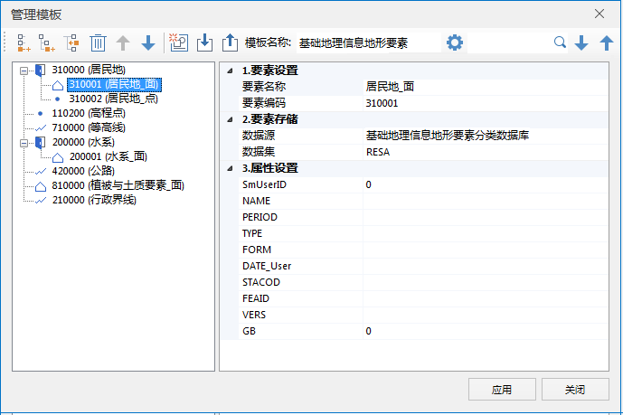

---
id: TemplateManager
title: 模板管理  
---  

符号化制图的模板定义了地物要素的名称、编号、存储该要素的数据集，及该要素的固定属性值，选中模板中的指定要素，即可在地图中绘制该要素。根据模板进行矢量化，可以便捷、清晰的绘制地物要素，和属性录入，避免了在多要素绘制过程中来回切换图层管理器和属性面板，提高了矢量化的工作效率。

符号化制图提供了预定义的国情普查模板，用户可根据需要自定义模板，模板管理提供了模板新建、导入、导出、修改等功能，具体说明如下：

### 新建模板

新建模板可在模板中添加指定要素的名称、编码，将要素与当前工作空间中的数据集建立关联关系，并支持设置数据集的默认固定属性，具体操作步骤如下所述：

**操作步骤**

1. 在当前工作空间中打开模板要素所要关联的数据源，并打开地图窗口。
2. 单击“ **对象操作** ”选项卡，在“ **对象绘制** ”分组中单击“ **符号制图** ”按钮，即可弹出“ **符号化制图**
”面板。
3. 单击“管理模板”下拉按钮，选择“新建模板”选项，即可弹出如下图所示的“管理模板”对话框，在对话框中可设置模板名称、添加要素，设置关联数据集等参数。

  

4. **模板名称** ：在工具栏的“模板名称”文本框中，输入模板名称。

5. **添加节点** ：模板管理提供了三种添加节点的方式，即：新建根节点、新建子节点、插入节点三种。

* **添加根节点**：可在模板树节点中新建一级节点，如上图中的居民地、高程点、水系。

* **添加子节点**：可为模板树节点中选中节点新建一个子节点，如上图中的居民地_面、居民地_点。

* **插入节点**：可在模板树节点中新建一个一级节点，如上图中的居民地、高程点、水系。

6. 设置要素信息：添加要素节点之后，选中要素节点可设置要素名称、要素编码、关联数据集、默认属性值等信息。

* **要素设置** ：设置树节点中选中要素的名称和编码，树节点名称则会显示此处设置的要素编码和要素名称。

* **要素存储** ：设置与要素关联的数据集，在地图中绘制该要素对象之后，对象会直接存储到设置的数据集中。

* **属性设置**：可设置该类要素的默认属性值，在地图中绘制该要素后，对象的属性值会自动赋予此处设置的默认值。未设置值域的字段支持直接输属性值；若属性字段的值域为枚举型，则可通过下拉选项进行设置，如下图所示。此处默认显示了关联数据集中的所有非系统字段，当字段较多时，可单击工具栏中的“设置关键字段”按钮，勾选需显示的字段。

  
---  

7. **删除**：单击工具栏中的“删除”按钮，可将当前选中的要素删除，删除要素结点后，将无法恢复，单击提示对话框中的“是(Y)”后，即可将选中要素节点删除。

8. 上移下移：可用于调整要素节点的显示顺序，选中待调整的节点，单击工具栏中的“上移”或“下移”按钮即可平级移动节点位置。

9. **保存**：制作好模板之后，单击对话框中的右下角的“应用”按钮，即可将模板保存到当前工作空间中，在“符号化制图”面板中选择该模板，即可基于模板进行对象绘制。

  

### 导入模板

符号化制图支持导入模板，可将已配置好的模板文件（*.xml）导入到当前工作空间中，节约了模板制作的时间成本。操作步骤如下：

1. 在“符号化制图”面板中，单击“管理模板”下拉按钮，在下拉选项中选择“导入模板”。

2. 弹出“打开”对话框后，在对话框中选择待导入的模板文件（*.xml），单击“打开”按钮，即可将模板导入到当前工作空间中。

3. 单击“符号化制图”面板中的“管理模板”按钮，选择导入的模板，即可切换当前模板，并可基于该模板进行绘制。

### 导出模板

符号化制图提供了导出模板的功能，便于模板的分享，可将导出的模板分享给有需要的用户。在“管理模板”对话框工具栏中，单击“导出”按钮，在弹出的“另存为”对话框中，设置模板保存了路径和名称，单击保存按钮即可将模板导出为*.xml 文件。

导出的XML文件记录了模板名称、要素名称、要素编码、存储数据集名称、类型等信息，模板文件结构如下图所示：

  
### 模板管理

符号化制图支持模板管理功能，模板管理支持的功能与新建模板一致，具体说明请参见新建模板。

###  相关主题

[### 符号化制图示例](SymbolicMappingExample)  

[### 属性编辑](SymbolicMappingPropertySettings)

