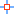

---
id: DTv2_Snappable
title: 开启图层捕捉  
---  
 ### 使用说明

 “可捕捉”命令，用来控制该矢量图层是否可捕捉，即当在矢量图层中进行选择、编辑等操作时，鼠标是否可以捕捉到该矢量图层中的对象。

 ### 操作步骤

1. 右键单击图层管理器中的矢量图层结点，在弹出右键菜单中单击选择“可捕捉”命令。

2. 单击后，如果“可捕捉”命令前面出现 
对号，表示使图层可捕捉，即图层中的对象可以被鼠标捕捉到；否则不可捕捉。

3. 在“图层属性”界面中，勾选“可捕捉”复选框，则图层中的对象可以被鼠标捕捉到。

### 注意事项

1. 图层管理器中矢量图层结点前的 
按钮，也是用来控制矢量图层是否可捕捉，可通过单击该按钮实现可捕捉的控制。当按钮处于  状态时，矢量图层可捕捉；当按钮处于
 状态时，矢量图层中的对象不可以被捕捉到。

2. 图层只有处于可捕捉，且为可编辑状态下，当在图层中进行选择、编辑等操作时，鼠标才能捕捉到该图层中的对象。

  

 * * *

   
  
 ---

