---
id: SnappIntrtoduct
title: 支持的捕捉类型  
---  
 下面以图示和文字来详细介绍各个捕捉类型的具体含义。

 捕捉按钮 | 捕捉描述 | 图示  
 ---|---|---  
  |使当前绘制的线与其他线性要素（包括延长线）垂直。图示说明：正在绘制的线段与任一已有线段垂直。| 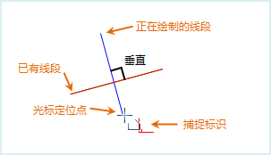  
  |使当前绘制的线与其他线性要素平行。图示说明：正在绘制的线段与任一已有线段平行。| 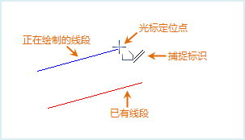  
  |使当前绘制的线水平或垂直。图示说明：正在绘制的线是水平的。| 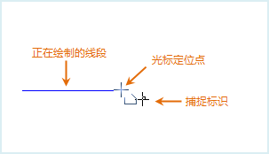  
  |使当前绘制的线与其他要素上的点相交。图示说明：正在绘制的线段经过任一线段的端点。| 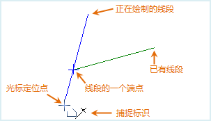  
  |以固定长度绘制当前线段。图示说明：正在绘制的线段的长度为一固定值。| 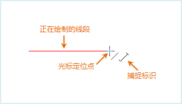  
  | 使当前绘制的线段与前一线段成固定角度。图示说明：正在绘制的线段与上一线段构成一固定角度，此处所设置的固定角度值为 90 度。| 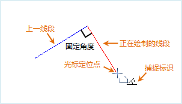  
  |使当前绘制的点在端点（线的端点或多边形边界线的端点）上。图示说明：捕捉到线的端点。| 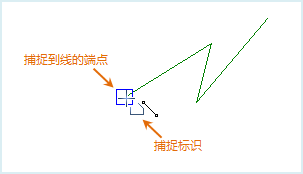  
  |当前鼠标点与其他线性要素上的点构成水平或垂直线。图示说明：鼠标定位点与任一线段端点连接而成的虚拟线是水平的或竖直的。| 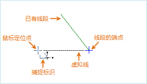  
  |使当前绘制的点在其他线性要素上。图示说明：捕捉到线，即当前鼠标定位点在捕捉到的线上。| 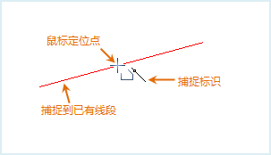  
  |使当前绘制的点在其他线性要素的中点上。图示说明：捕捉到线的中点。| 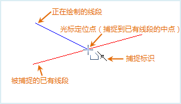  
  |使当前绘制的点与其他点对象或节点重合。图示说明：捕捉到线的中间节点。| 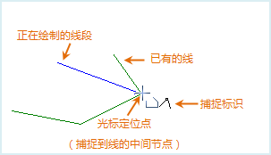  
  |使当前绘制的点在其他线性要素的延长线上。图示说明：捕捉到线的延长线上一点。| 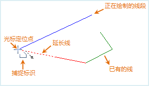  
 
