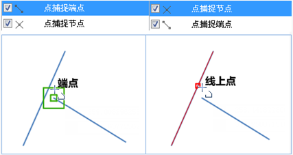
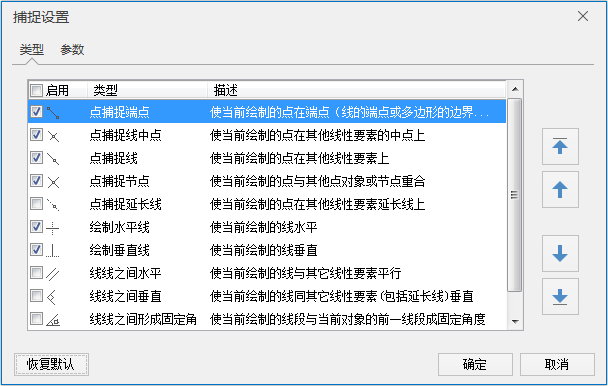
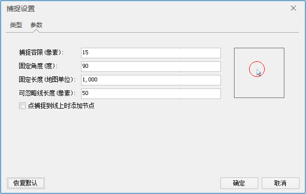

---
id: Snapping
title: 使用捕捉  
---  
 用户在编辑和制图时，常常需要定位到特定位置处，但通常这些位置在实际制图时使用手工不能很轻松准确地定位到。基于这种需求，SuperMap
提供了强大的图形捕捉功能，由系统来进行智能捕捉定位，不仅提高了编辑和制图的精度和效率，而且还能避免出错。实际操作时，我们可以自由选择捕捉类型。当启用捕捉功能时，当前绘制的节点会自动捕捉到容限范围内的边、其他节点或者其它几何要素。

 用户在编辑操作时，可在工具条和菜单栏中动态设置捕捉项。同时可通过单击“ **对象操作** ”选项卡上的“ **对象操作** ”组的“ **捕捉设置**
”按扭，弹出“捕捉设置”对话框。用户可以对捕捉的类型和捕捉参数进行相关的设置。

 ### 捕捉类型设置

* “ **类型** ”选项卡用来控制相应的捕捉类型的开启和关闭。“ **类型**
”选项卡下面的列表中，列举了常用的12种捕捉关系。各个捕捉功能的具体含义的说明和图示，请参见[支持的捕捉类型](SnappIntrtoduct.htm)。当某一捕捉类型被勾选时，表示开启相应的捕捉功能；当某一类型未被勾选时，表示相应的捕捉功能被关闭。

* 优先级：可设置列表中捕捉类型的优先级，捕捉类型在列表框中的排列顺序决定了捕捉类型的优先级，排在上面的捕捉类型优先级高于排在下方的捕捉类型，如下图所示。选中某一条或多条捕捉类型，可通过“优先级”右侧的置顶、置底、上移、下移按钮，调整选中项的优先级。

  
---  
图：捕捉项优先级  
* 启用：选中“启用”复选框，表示启用所有的捕捉类型；取消勾选该复选框表示禁用全部的捕捉类型。

* 恢复默认：单击对话框中的“恢复默认”按钮，即可恢复系统默认选中的捕捉类型。

  
---  
图：捕捉类型  

# 捕捉参数设置

“ **参数** ”选项卡用来对捕捉的相关参数进行设置。包括捕捉容限、角度、长度、捕捉对象数、捕捉长度、是否添加结点等设置内容。

  
---  
图：捕捉参数  
* 捕捉容限

捕捉容限可设定的范围取值为1-20，单位为像素，默认值为15。如果设置的捕捉容限超过20，则系统会提示大于最大值。
若待捕捉对象与光标的距离在设定范围内，该对象即被捕捉。如对话框右下角的光标定位区示意图中所示，红色圆圈（即光标定位区）的大小随着捕捉容限设定值的不同而变化。

* 固定角度

固定角度可设定的范围为0-360，单位为度，默认值为90。如果设置固定角度不在默认范围，则系统会有提示信息。画线时，如待画线段与其他线段的夹角等于设定的角度，系统会使用固定角度捕捉的图标予以提示。

* 固定长度

固定长度的单位与地图坐标单位一致，默认值为1000。如待画线段的长度等于设定的长度，系统会使用固定长度捕捉的图标给出提示。

* 可忽略线长度

可设定的忽略的线长度的范围为1-120，单位为像素，默认值为50。如果设置的忽略的线长度范围不在默认范围内，则系统会有提示信息。可忽略的线长度的值即为捕捉线的最小长度。当线对象的长度小于设定值时，不会对其进行捕捉。

* 点捕捉到线上时添加节点

勾选该项，表示在点捕捉到线上时，会在线的捕捉点位置处插入一个节点；不勾选该项则在点捕捉到线上时，不会在捕捉位置处插入节点。

* 恢复默认

单击该按钮，即可将捕捉设置的参数恢复为默认的参数。

### 注意事项

* 捕捉设置为全局设置，设置后对所有地图窗口都生效，并且重启程序后会保存上一次关闭前的捕捉设置。

