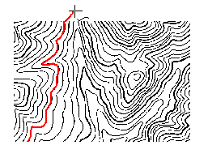

---
id: TraceLine
title: 矢量化线  
---  
 ### 使用说明

 通过多次人机交互，对栅格底图中的线进行矢量化。

 ### 操作步骤

1. 在“ **对象操作** ”选项卡的“ **栅格矢量化** ”组中，单击“ **矢量化线** ”按钮，会自动弹出“
**栅格矢量化**
”对话框，需要对矢量化的相关参数进行设置。如果已经完成了设置，直接单击“确定”按钮，进行矢量化操作。关于如何设置“栅格矢量化”参数，请参见[栅格矢量化设置](TraceSet.htm)页面。

2. 将鼠标移至需要矢量化的线上，单击鼠标左键开始矢量化该线对象。

3.
矢量化至断点或者交叉口，矢量化会停下来，等待下一次矢量化操作。此时跨过断点或者交叉口，在前进方向的底图线上双击鼠标左键，矢量化过程会继续，直到再次遇到断点或交叉口处停止。

4. 遇到线段端点，单击鼠标右键进行反向追踪。

5. 重复第三步，直到完成一条线的矢量化操作。

6. 再次单击鼠标右键结束矢量化操作。如果曲线是闭合的，则矢量化过程中会自动闭合该线，并结束此次矢量化操作。

 ### 备注

 * **矢量化操作图示说明**

 说明|示意图  
 ---|---  
 1：移动鼠标到需要跟踪的图像线上，单击鼠标左键开始绘制该图像线。遇到线段端点，停止绘制。在前进方向的底图线上双击鼠标左键，矢量化过程会继续。 |  
2：单击鼠标右键进行反向矢量化绘制，遇到另一个端点，矢量化绘制结束。|   
3：再次单击鼠标右键退出当前矢量化绘制，得到一个线对象。|   
  
* 在矢量化跟踪过程中，由于栅格底图原因，可能对某些矢量化效果不太满意，可以点击“矢量化线回退”按钮，回退一部分线，单击鼠标左键确定，或单击右键，回到当前矢量化绘制状态。

* 如果栅格底图中线的大小不合适，可用“放大”、“缩小”等功能调整图像大小，以便能看清线的细节，然后单击鼠标右键，回到矢量化绘制状态。

* 在矢量化绘制过程中，单击 Esc 键或者在“栅格矢量化”组中单击“矢量化线”功能按钮，即可取消当前的绘制。

* 通过 Alt + Q 快捷键，可以快速便捷地使用矢量化线功能。

  

 * * *

   
  
 ---

