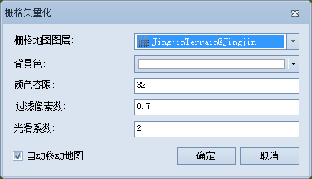

---
id: TraceSet
title: 交互式半自动化栅格矢量化设置  
---  

开始进行半自动栅格矢量化，需要先做一些准备工作：首先至少存在一个配准好的栅格底图，其次要有一个用于绘制矢量线或者面的数据集。然后栅格底图和线/面数据叠加与同一个窗口中显示，且矢量数据集处于可编辑状态，栅格矢量化功能才可用。

 ### 使用说明

 在进行半自动栅格矢量化前，需要对栅格矢量化的参数进行设置。

 ### 操作步骤

1. 在“ **对象操作** ”选项卡的“ **栅格矢量化** ”组中，单击“ **设置** ”按钮，弹出“ **栅格矢量化**
”对话框，如下图所示。

或执行以下操作，也可完成相关设置：

如果当前地图窗口中，存在一个影像图层以及可编辑的线、面或者 CAD
图层时，矢量化线、矢量化面功能可用，单击“矢量化线”或“矢量化面”按钮，会自动弹出“栅格矢量化”对话框。

  
---  
图：“栅格矢量化”对话框  
2. 在该对话框中，对栅格矢量化的参数进行设置，参数如下：

* **栅格地图图层** ：设置用于栅格矢量化的栅格底图。当存在多个栅格图片时，可以通过下拉箭头切换需要矢量化的栅格图层。

* **背景色** ：设置栅格地图的背景色。在栅格矢量化过程中，将不会追踪栅格地图的背景色。默认背景色为白色。

* **颜色容限** ：栅格底图的颜色相似程度，在矢量化过程中，只要 RGB
颜色任一分量的误差在此容限内，则应用程序认为可以沿此颜色方向继续进行矢量化。取值范围为[0-255]，默认值为32。

* **过滤像素数**
：设置去锯齿过滤参数，即光栅法消除线对象锯齿抖动的垂直偏移距离（单位为图像像素），默认值为0.7。去锯齿过滤参数越大，过滤掉的点越多。

* **光滑系数** ：将栅格矢量化时，需要进行光滑处理。设置的光滑系数越大，则结果矢量线/面的边界的光滑度越高。

* **自动移动地图**
：如果处于选中状态，则表示自动移动地图。当矢量化至地图窗口边界上时，窗口会自动移动；反之，则表示需要手动移动地图。应用程序默认为选中状态。

3. 设置完成后，单击“确定”按钮，完成设置并退出该对话框；否则，将取消所有参数设置，并退出该对话框。

 用户在“栅格矢量化”窗口中所做的相关设置会自动保存，下次打开“栅格矢量化”窗口，可以基于上次设置的参数进行修改。

  

 * * *

   
  
 ---

