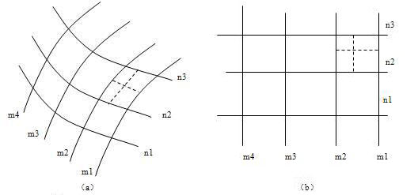
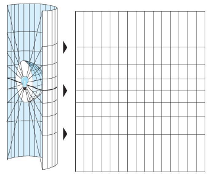

### 投影的定义

地球椭球体表面是曲面，而地图通常要绘制在平面图纸上，因此制图时首先要把曲面展为平面。然而球面是个不可展的曲面，换句话说，就是把它直接展为平面时，不可能不发生破裂或褶皱。若用这种具有破裂或褶皱的平面绘制地图，显然是不实用的，所以必须采用特殊的方法将曲面展开，使其成为没有破裂或褶皱的平面，于是就出现了地图投影理论。其基本原理就是：因为球面上一点的位置决定于它的经纬度，所以实际投影时是先将一些经纬线的交点展绘在平面上，再将相同的经纬度的点连成经线，相同的纬度的点连成纬线，构成经纬网。有了经纬网以后，就可以将球面上的点，按其经纬度展绘在平面上相应的位置处，如下图所示,按经纬度将球面上的点转移到平面上。

  

  
### 投影的实质

许多分析技术和空间数据都是针对二维坐标或平面坐标而设计的，需要以平面地图投影的方式来存储空间坐标，因此很多时候我们都需要利用地图投影将三维的地理坐标转换为二维平面坐标。所谓的地图投影就是通过特定的数学方程式将经纬坐标（λ，φ）转换为平面坐标（X，Y）。从三维坐标转换为二维坐标时总会出现扭曲变形，地图投影就是用来减小这种变形的。

由上可知，地图投影的使用保证了空间信息从地理坐标变换为平面坐标后能够保持在地域上的联系和完整性，这是地图制图的基本要求，也是进行空间操作和空间分析的基本前提，因此地图投影对于地理数据在GIS中的应用是很重要的。

### 投影的方法

投影方法有两种，分别是几何透视法和数学解析法。

* 几何透视法 

几何透视法，是利用物体之间的透视关系，将地球表面上的点投影到投影面上的一种投影方法。例如，以平面、圆柱面、圆锥面为承影面，将曲面（地球椭球体面）转绘到平面（地图）上，如下图示意，透视投影法示意图：

  

* 数学解析法

数学解析法是建立地球椭球体面上的经纬网与平面上相应经纬网之间对应关系的方法。实质就是直接确定球面上某点的地理坐标与平面上对应点的直角坐标之间的函数关系。当前绝大多数地图投影都采用这种方法。

### 投影变形

地球椭球体是一个不可展曲面，而地图是一个平面，因为把这样的一个球面展开为平面，势必会造成某些部分的破裂或重叠，从而使位于这部分的地物和地貌变得不连续和不完整，从实际应用的角度出发，必须将裂开或重叠的部分予以均匀的拉伸或压缩，以消除裂缝和褶皱。在拉伸和压缩的时候，地图上这些部分就与地球体的相应部分失去了相似性，这种变化就是因为投影而产生的变形。这种由球面向平面投影时引起的经纬网几何特性的变化，称为地图投影变形。

地图变形有：长度变形、角度变形、面积变形和形状变形。

* 长度变形

长度变形是指长度比与1之差，而长度比是投影面上一微小线段和椭球体面上相应微小线段长度之比。长度变形用来反映线段投影后变化的程度，它是所有投影上都存在的最基本的变形，正是由它而引起了面积和角度变形。

* 角度变形

角度变形是指投影面上任意两方向线所夹之角与椭球面上相应的两方向线夹角之差。角度变形是形状变形的具体标志。

* 面积变形

面积变形是指面积比与1之差，而面积比是投影面上一微小面积与椭球面上相应的微小面积之比。面积变形是衡量地图投影变形大小的一种数量指标。

* 形状变形

形状变形是指地图上轮廓形状与相应地面轮廓形状的不相类型。

