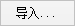
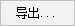

### 使用说明

若用户需将某一点的坐标转换为另一坐标系下的坐标，可通过“坐标点转换”功能进行转换，得到该点在其他坐标系下的坐标值，坐标点转换可以在两个地理坐标系下进行坐标点的转换，也可以在两个投影坐标系下进行坐标点的转换，也可以在地理坐标系与投影坐标系之间进行坐标点的转换。

### 操作步骤

1. 在“ **开始** ”选项卡的“ **数据处理** ”组中，单击“ **投影转换** ”下拉按钮，选择“ **坐标点转换** ”按钮，弹出“坐标点转换”对话框。 
2. 在“源坐标点”处直接输入点的经纬度或X/Y坐标值，若源坐标点投影为地理坐标系，还可勾选“以度：分：秒形式显示”复选框，输入点坐标经纬度具体的度分秒数值。
3. 源坐标系：可在“源坐标系”处设置源数据的坐标系，坐标点转换功能不支持平面坐标转换，源数据和目标数据坐标系只能设置为地理坐标系或投影坐标系。坐标系设置有以下三种方式： 
* 来自数据源：选择“来自数据源”单选框，单击右侧下拉按钮，选择点数据所在数据源或其他数据源，将数据源坐标系设置为点坐标系。 **注意** ：此处只显示当前工作空间中地理坐标系或投影坐标系的数据源，平面坐标系数据源不可选。
* 投影设置：选择“投影设置”单选框，单击“设置...”按钮，在弹出的“投影设置”窗口中，选择程序提供的一种与源点数据不同的地理坐标系或投影坐标系，将其设置为目标坐标系。设置目标投影的具体操作，请参考[“投影设置”窗口](PrjCoordSysSettingWin.htm)。
* 导入投影文件：选择“导入投影文件”单选框，单击按钮，在弹出的“选择”窗口中，选择投影信息文件并导入即可。
4. 目标坐标系：可在“目标坐标系”处设置结果坐标点投影坐标，将结果坐标系设置为与源坐标系不同的一种地理坐标系或投影坐标系，设置方式与“源坐标系”投影设置方式一致。 
5. 参照转换设置：单击“转换方法”标签右侧的下拉按钮，弹出的下拉菜单列表显示了系统提供的十余种投影转换的方法，用户可选择一种合适的投影转换方法。关于转换方法的说明，请参考[参照系转换方法说明](PrjConvertMethods.htm)。
6. 投影转换参数：选择不同的转换方法，在“投影转换”对话框中可以自定义的参数不同。 
* 选择的为三参数转换法，如 Geocentric Transalation、Molodensky 或 Molodensky Abridged，则“投影转换”对话框需设置X、Y、Z方向的“偏移量”的参数。 

用户需要设置三个平移参数，即（ΔX，ΔY，ΔZ）。此种转换实质上是一种地心变换，从一个基准面的中心（0,0,0）转换到另一个基准面中心（ΔX，ΔY，ΔZ）。三参数变换是线性的平移变换，单位为米。

* 如选择的七参数转换法，如为 Position Vector、Coordinate Frame 或 Bursa-wolf，则需设置比例差、旋转角度、偏移量几个参数。 

用户需要设置七个参数，即三个线性平移参数（ΔX，ΔY，ΔZ）、绕轴旋转的三个角度参数（Rx，Ry，Rz）和比例差（S）。平移参数以米为单位；旋转参数单位为“角度秒”；而比例差为百万分之一（ppm）。

关于不同的投影转换方法的介绍，具体请参考[参照系转换方法说明](PrjConvertMethods.htm)。

7. 导入、导出投影转换参数文件：单击“投影转换”对话框下方的  按钮，即可导入一个后缀名为 *.ctp 的投影转换参数文件，即可将投影转换参数文件中保存的参数信息导入，作为当前投影转换的参数设置；单击“投影转换”对话框下方的  按钮，即可将当前在“投影转换”对话框已设置好的参数导出到指定路径，之后需要使用时导入即可。 
8. 完成各项投影转换参数设置后，单击“转换”按钮，即可完成坐标点转换的操作。用户可在“坐标点转换”对话框的“结果坐标点”处，查看坐标点转换结果，若目标坐标系为地理坐标系，勾选“以度：分：秒形式显示”复选框，可以度分秒形式显示结果坐标点坐标。

### 备注

1. 坐标点转换是在不同的地理坐标系或投影坐标系之间进行的，若源坐标系与目标坐标系相同，则不进行转换，同时会有“坐标点转换失败”弹出框提示。
2. 在实际的工作中，采用哪种转换方法要视具体情况而定。对于各个参数的确定，请购买权威的测量数据，或者通过两个坐标系统中已知控制点的坐标对参数的正确性进行验证。

