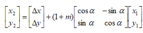
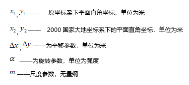

### 使用说明

四参数转换用于地方坐标系转换到投影坐标系，设置四个转换参数（x偏移、y偏移、旋转角、缩放系数）和目标投影坐标系。四参数转换多用于地方独立坐标系与国家统一坐标系之间的转换。

**四参数转换公式：**    

  

  
  
### 操作步骤

  1. 在工作空间管理器中选择需要四参数转换的数据集，在“ **开始** ”选项卡的“ **数据处理** ”组中，单击“ **投影转换** ”下拉按钮，选择“ **四参数转换** ”项，弹出“四参数转换”对话框。
  2. “源数据”处默认显示选中的数据集和数据集所在的数据源，可以通过下拉箭头进行重新选择。
  3. “源坐标系”处显示了源数据集坐标系的详细描述信息，包括坐标系名称、坐标单位、投影参数等。
  4. 转换参数等设置，包括四参数值、结果存储位置、目标坐标系。 
  * 四参数值在“四参数设置”处进行设置，直接在x偏移、y偏移、旋转角度、缩放系数（输入系数K，m = k/1000000）后的文本框中输入确定的数值即可。
  * 结果存储位置在“结果另存为”处，默认勾选“结果另存为”复选框，可修改转换结果存储的数据集和对应的数据源。
  * 目标坐标系在“目标坐标系”处，提供了四种设置方式，具体操作如下所述。设置好目标投影之后，“坐标系信息”处会显示目标投影的详细信息。
    * **来自数据源** ：选择“来自数据源”单选框，单击组合框下拉按钮，选择一个数据源，将该数据源的坐标系设置为目标坐标系。
    * **来自数据集** ：选择“来自数据集”单选框，单击组合框下拉按钮，选择一个数据集，将该数据集的坐标系设置为目标坐标系。
    * **投影设置** ：选择“投影设置”单选框，单击  按钮，弹出“投影设置”窗口，设置目标投影。设置目标投影的具体操作，请参考[“投影设置”窗口](PrjCoordSysSettingWin.htm)。
    * **导入投影文件** ：勾选“导入投影文件”单选框，单击其右侧的按钮，在弹出的“选择”窗口中，选择投影信息文件并导入即可。支持导入 shape 投影信息文件（*.shp;*.prj）、MapInfo 交换格式（*.mif）、MapInfo TAB 文件（*.tab）、影像格式投影信息文件（*.tif;*.img;*.sit）、投影信息文件（*.xml）。
    * **坐标系信息** ：用于显示目标坐标系的详细参数信息。
  5. 完成各项投影转换参数设置后，单击“转换”按钮，即可完成投影转换的操作。用户可在输出窗口中，查看投影转换结果。

