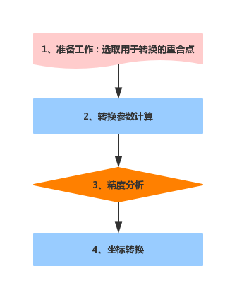

---
id: Coordinatetransformation
title: 转换模型参数计算  
---  
  
 目前常用的坐标系有 1954北京坐标系、1980西安坐标系、WGS 84大地坐标系以及现行要求使用的2000国家大地坐标系等，下表为各坐标系的相关参数：

 坐标系统 | 参考椭球 | 长半轴 | 扁率  
 ---|---|---|---  
 1954年北京坐标系 | 克拉索夫斯基 | 6378245 | 1：298.3  
 1980西安坐标系 | IAG-75国际椭球 | 6378140 | 1：298.257  
 WGS 84 | WGS 84 | 6378137 | 1：298.257223563  
 2000国家大地坐标系 | CGCS2000 | 6378137 | 1：298.257222101  

由以上参数可知四种坐标系的参考椭球基体和基准面均各不相同，因此对于地球位置同一点在不同坐标系下的坐标值也不相同。当需要将一份数据从一种坐标系转换到另外一种坐标系时，首先要搞清楚转换的严密性问题，即在同一个椭球里的坐标转换都是严密的，而在不同的椭球之间的转换是不严密的。例如，由1954北京坐标系的大地坐标转换到1954北京坐标系的高斯平面直角坐标是在同一参考椭球体范畴内的坐标转换，其转换过程是严密的。由1954北京坐标系到2000
国家大地坐标系的转换是属于不同椭球体间的转换，没有一套完全不变的参数在地球各个位置都是用。因此需要通过转换模型，将空间点从某一参考椭球基准下的坐标转换到另一参考椭球基准下。基准转换的过程就是转换参数的求解过程。得到转换参数之后再在同一椭球基准下进行坐标系转换，才能完成数据最终的转换，否则数据不能正确转换。

 ###  坐标转换技术流程

   
 ---  
   1. **准备工作**：收集和整理用于转换的重合点坐标资料，并分析选取用于转换的重合点，重合点的个数应满足要求，重合点应可靠、精度高，重合点应均匀布设覆盖整个测区。

   2. **转换参数计算**：根据已有重合点成果和转换要求，确定参数计算的转换模型。计算时应具有多余重合点，并用最小二乘法最为约束条件，计算转换参数。

   3. **精度分析**：根据转换参数计算目标坐标系重合点坐标，分析转换残差，转换残差，转换残差即重合点转换后坐标与已知坐标之差，计算坐标残差中误差来评估坐标转换精度，并根据残差限差（3倍残差中误差）剔除粗差。如转换精度评估不合格，应重新选取重合点坐标进行参数计算。

   4. **坐标转换** ：根据最终合格的转换参数计算目标坐标系其他地物坐标。

 **注意事项** ：在进行坐标转换之前，用户需要了解以下问题：

   1. [如何选择重合点？](TransformationParaStep)

   2. [如何选择转换模型？](TransformationModel)
