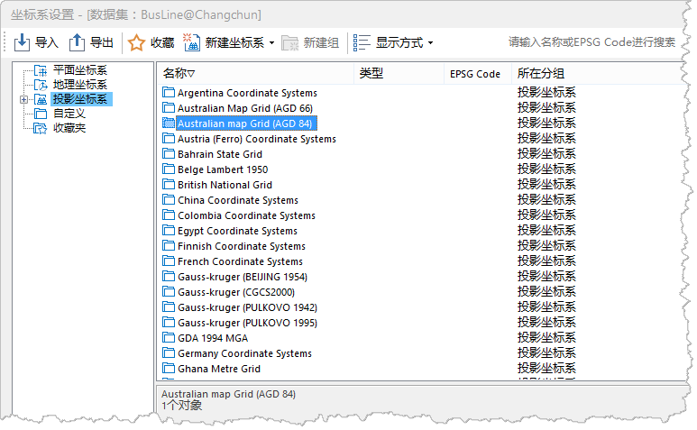

---
id: PrjCoordSysDia
title: 设置投影坐标系  
---  
### 使用说明

“投影设置”对话框用于设置当前工作空间中选中数据源、数据集或当前地图的投影坐标系信息。

### 操作步骤

系统提供了包括用户自定义在内的大量国内外常用的基本投影类型供用户选择，用户可在“投影设置”对话框中选择一种系统提供的投影坐标系，或自定义一种投影坐标系，应用于当前选中的数据源、数据集或当前地图。

  1. 单击“投影设置”下拉按钮，在下拉菜单中选择“投影设置”按钮，即可弹出“坐标系设置”窗口。
  2. 点击左侧目录树的“投影坐标系”节点文件夹后，右侧的文件列表中会列出系统预定义提供的坐标系信息。选择需要设定的投影坐标系，可在工具栏窗口的”搜索“框中输入坐标系文件的全部或部分字符，快速定位。
  
---  
  3. 若系统预定义的坐标系统中不能满足用户，用户还可自定义投影坐标系，请参见[新建投影坐标系](NewProCoordSys.htm)。 
  4. 选择相关投影坐标系文件后，单击“应用”按钮即将选择的投影坐标系应用于当前选中的数据源、数据集或地图。 
