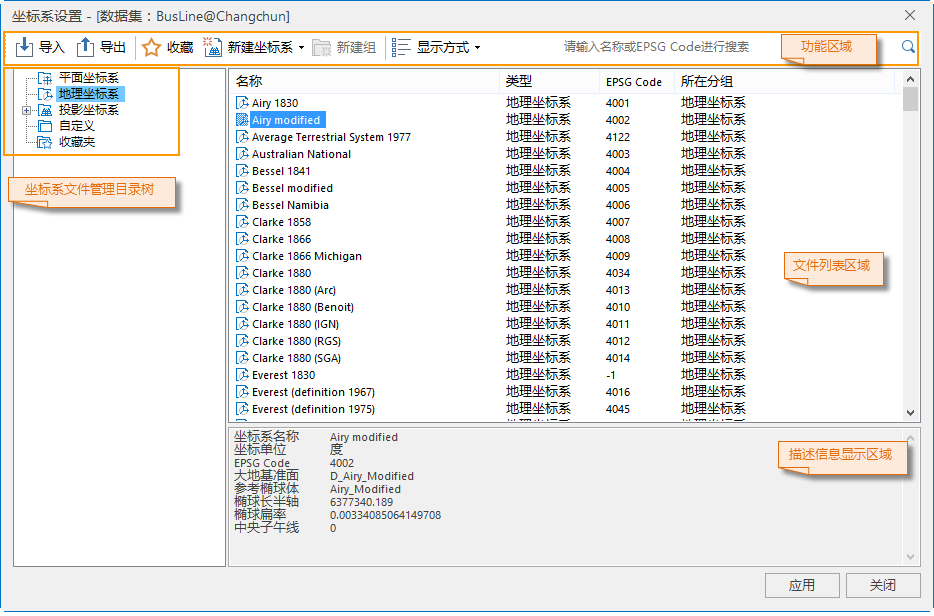

---
id: PrjCoordSysSettingWin
title: 投影设置  
---  
 ### 使用说明

“坐标系设置”窗口用于自定义、设置以及管理当前工作空间中数据源、数据集或地图的坐标投影信息，其结构大致分为：功能区域、坐标系文件管理目录树、文件列表、描述信息显示区域。

   

 ### 功能区域

 位于“坐标系设置”窗口上部的功能区域，提供菜单工具栏和检索功能。

   1. **导入坐标系** ：单击“导入”按钮，弹出“导入坐标系”对话框，用户可指定坐标系文件的路径，即可加载一个坐标系文件。

 系统支持7种投影信息文件，分别是：影像格式坐标系文件（*.tif;*.sit;*.img）、Shape坐标系
文件（*.shp；*.prj）、MapInfo 交换格式（*.mif）、MapInfo TAB 文件（*.tab）、坐标系文件（*.xml）

   2. **导出坐标系**:单击“导出”按钮，弹出“浏览文件夹”对话框，用户可指定导出坐标系文件的保存路径，单击“确定”按钮，即可完成坐标系文件的导出功能。
 支持同时导出单个或多个坐标系文件，同时支持导出一个或多个文件夹坐标系文件。
   3. **收藏**：为了方便用户对常用的一些坐标系文件的使用和管理，在投影设置中提供了收藏夹功能。可以将目前常用的一些投影文件收藏到收藏夹中，便于下次继续使用。收藏夹中可以添加分组，对不同类型投影文件进行分组管理或者直接将分组中的投影文件导出。

      * 选中文件列表区域中的某个坐标系文件。单击“收藏”按钮，弹出“添加收藏”对话框。

      * 在“添加收藏”对话框中设置坐标系名称，添加的坐标系文件默认保存在默认收藏夹内。用户可单击对话框左下侧的“新建文件夹”，创建新的文件夹，新建文件夹默认作为收藏夹的子文件夹。

      * 完成设置后，点击“添加”按钮，所选择的坐标系文件即添加在收藏夹中。

      * 添加至收藏夹的投影信息文件列表显示在单击“投影设置”下拉按扭的下拉菜单中。

      * 所有添加到收藏夹中的坐标系文件，将按照投影信息管理目录树中的组织结构，进行存储。

      * 存储路径为：安装目录\Templates\Projection\MyFavorite\ 目录下。

   4. **新建坐标系**：支持[新建地理坐标系](NewGeoCoordSys)、[新建投影坐标系](NewProCoordSys)、[通过EPSG编码创建坐标系](NewGEPSGCoordSys)，且支持对现有坐标系文件进行复制及修改等操作。所有新建的坐标系默认存放在自定义目录中。

   5. **新建组** ：单击工具条中的 “新建组”按钮，即可在当前选中的坐标系文件管理目录树中结点下，创建一个名为 NewGroup 新子组。

   6. **显示方式**：显示方式按钮用来控制"坐标系设置"窗口中文件列表区域的图标显示风格，主要分为4种形式：大图标、小图标、列表、详细。单击“显示方式”下拉按钮，单击某种显示方式按钮，即可切换文件列表区域的图标显示样式。

   7. **搜索功能**：在搜索的文本框中，可输入坐标系文件名称的全部或部分字符，即可在当前选中的目录树子组中搜索包含这些字符的坐标系文件。还可通过输入 EPSG Code
的值进行搜索。

 ### 坐标系文件管理目录树

位于“坐标系管理”窗口左上部的坐标系文件管理目录树，主要用于管理坐标系文件的分组以及浏览坐标信息文件。目录树按照平面坐标系、地理坐标系、投影坐标系、自定义及收藏夹等五个总节点依次排列。单击坐标系文件管理目录树中的某一文件夹结点，在右侧的文件列表区域可显示该文件夹下所有坐标信息文件。

 ### 文件列表区域

 文件列表区域，主要用于浏览、设置与管理坐标系配置文件。根据用户在坐标系文件管理目录树中选中不同的文件夹结点，文件列表区域显示的内容不同。

 ### 描述信息显示区域

 主要用于显示坐标系文件的描述信息。

* 若在文件列表区域中选中地理坐标系文件夹下或投影坐标系文件夹下的某个坐标系文件，描述信息区域中会显示坐标系文件的投影类型、参数等详细信息。

* 若在文件列表区域中选中某个自定义的坐标系文件，则在描述信息显示区域显示出该自定义坐标系文件的投影类型、参数等详细信息。

* 若在坐标系管理目录树中选中某个文件夹，则在描述信息显示区域显示当前选中文件夹的名称和包含的对象数目。

 ### 坐标系设置窗口右键菜单功能

在坐标系文件管理目录树区域和文件列表区域，提供右键功能包含复制、粘帖、定位、查看、新建组、新建坐标系、修改坐标系、重命名、删除、导入导出坐标系以及收藏等12项。根据选择文件节点的不同，可用功能也不相同。详细右键功能描述如下：

   * **复制**：拷贝当前选中的某一个坐标系文件子组到剪切板。

   * **粘帖**：用于粘贴当前剪切板中复制的坐标系文件。右键菜单中的“粘贴”项只有当在文件列表区域中不选中任何坐标系文件，且剪切板中存在已复制的坐标系文件时才为可用状态。

   * **定位**
:在功能区搜索框中，输入搜索坐标系文件的全部或部分字符，在文件列表框中选择该坐标系文件，单击右键菜单中“定位”项，可快速定位至所属坐标系文件列表中。

   * **查看** ：用于当前文件列表区域中所有文件的图标显示风格，详细描述请参考功能区“显示方式”工具操作。

   * **新建组**：单击右键菜单中“新建组”项，即可在选中自定义文件夹结点下或收藏夹文件夹节点下创建一个名为“新建文件夹”的子文件夹。详细描述请参考同功能区“新建组”功能。

   * **新建坐标系**：支持新建地理坐标系、投影坐标系、通过EPSG编码获取坐标系，且支持对现有坐标系进行复制及修改等操作。所有新建的坐标系默认归类在自定义目录中。详细描述请参考功能区“新建坐标系”功能。

   * **修改坐标系** ：单击右键菜单中的“修改坐标系”项，可修改坐标系参数设置。详细描述请参考功能区“新建坐标系”功能中的参数设置。

   * **重命名** ：选中某一个坐标系文件子组，单击“重命名”项，即可进行重命名操作。只支持重命名自定义和收藏夹目录下的文件名称。

   * **删除** ：删除当前选中的某一个投影配置文件子组。只支持删除自定义和收藏夹目录下的文件信息。

   * **导入坐标系** ：在自定义目录中 ，支持导入坐标系文件。详细描述请参考功能区“导入”功能。

   * **导出坐标系** ：单击右键菜单中的“导出坐标系”项，用户可制定路径，导出选中的坐标系文件（*xml）。详细描述请参考功能区“导出”功能。

   * **收藏** ：通过右键菜单中的“收藏”项，可将选中的某一个坐标系文件添加到收藏夹，详细描述请参考功能区“收藏”工具操作。

 ### 相关主题

  [新建地理坐标系](NewGeoCoordSys)

  [新建投影坐标系](NewProCoordSys)

  [通过EPSG编码创建坐标系](NewGEPSGCoordSys)

  

 * * *

   
  
 ---

