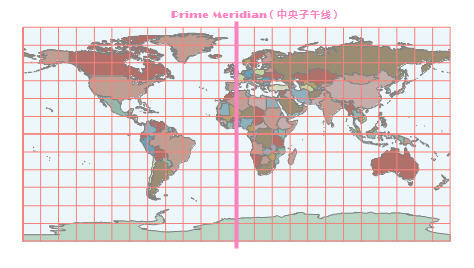
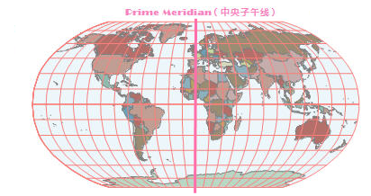

---
id: PrjCoordSysType
title: 坐标系的类型  
---  
在 SuperMap iDesktop 中，数据的坐标系分为三类：平面坐标系、地理坐标系、投影坐标系。

### [平面坐标系](PlaneCoordSysDia.htm)

一般用来作为与地理位置无关的数据的坐标参考，也是默认新建数据的坐标参考，如 CAD
设计图、纸质地图扫描后的图片、与地理位置无关的示意图等。平面坐标系是一个二维坐标系，原点坐标为（0，0），数据中每一个点的坐标是由其距水平和垂直的 X 轴和
Y 轴的距离确定。

  

  
### [地理坐标系](GeoCoordSysDia.htm)

使用经纬度坐标来表示椭球上任意一点的坐标。地理坐标系中，通常包含对水平基准、中央子午线和角度单位的定义。常用的地理坐标系如：WGS
1984、Beijing1954、Clarke 1866 等。例如，Google Earth 上的 KML 数据，全球定位系统采集的数据，都是以 WGS
1984 为坐标系的。大地测量获取的控制点坐标以西安80或 Beijing 1954为坐标系。图为 WGS 1984 坐标系的世界地图。

  
  
### [投影坐标系](PrjCoordSysDia.htm)

通过某种投影方式和投影类型，将椭球上的任意一点投影到平面上。使用二维平面坐标(X、Y）
来表示点线面地物的位置。投影坐标系中，通常包含对地理坐标系、地图投影、投影参数及距离单位的定义。常用的投影坐标系例如：Gauss
Kruger、Albers、Lambert、Robinson
等。一般，经过投影的地理数据，可进行地图量算、各种空间分析、制图表达等。例如，我国基本比例尺地形图中，1：100万地形图采用 Lambert
投影，其余大部分都采用了高斯-
克吕格6°带或者3°带投影。而城市规划中用到的大比例尺地图，如1：500，1：1000等的道路施工图、建筑设计图等多采用平面坐标系。图为原 WGS
1984坐标系的世界地图进行了 Robinson 投影。   
   

