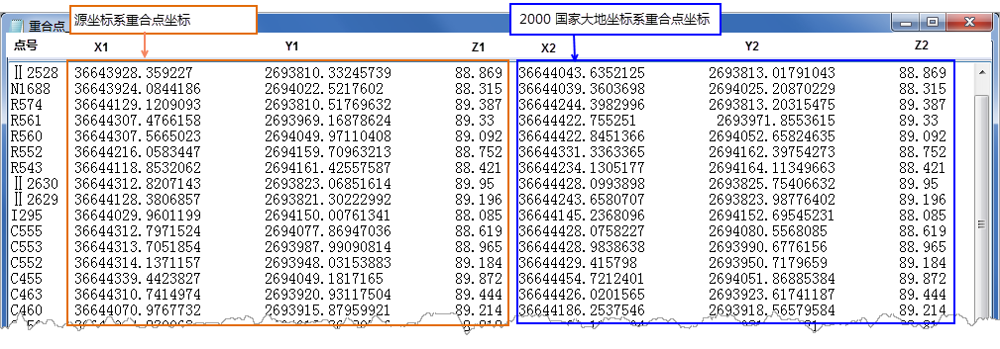

---
id: SuperpositionPoint
title: 重合点  
---  
  
重合点的选取对于转换参数的计算至关重要，用户需选取两个坐标系下均有坐标成果的控制点作为重合点。所谓控制点是以一定精度测定其位置为其他测绘工作提供依据的固定点。

  * **重合点选取的基本原则** ：等级高、精度高、分布均匀、覆盖整个转换区域、局部变形小。
  * **重合点数量要求** ：一般情况，向2000系转换重合点的选取，不少于6，外部检核点不少于6，点位都要均匀分布覆盖整个城市区域。考虑到可能存在粗差点，需要多准备几个重合点作为备用。总之，重合点应尽可能多选取。

  
 
  

