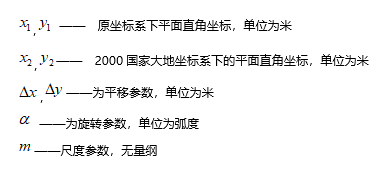

---
id: TransformationModel
title: 转换模型  
--->  
>  
> 桌面产品支持坐标转换模型有 **Position Vector(7-para)（位置矢量变换）、Coordinate Frame
(7-para)（坐标框架旋转变换）、China_3D_7P(7-para)（三维七参数转换模型）、China_2D_7P(7-para)（二维七参数转换模型）
及 China_2D_4P(4-para)（二维四参数转换模型）** 五种类型。

>

> ###  转换模型

>

>     * **Position Vector( 7-para)、Coordinate Frame (7-para)**
:这两种方法是通常所说的七参数变换，或者布尔沙模型，包括三个平移转换参数、三个旋转转换参数和一个尺度变化参数。二者可以认为是一种模型，只是不同的国家对旋转量的正负号定义标准不同而已。

>       * Position Vector（位置矢量变换），欧洲的定义，逆时针旋转为负。

>       * Coordinate Frame（坐标框架旋转变换），美国和澳大利亚的定义，逆时针旋转为正。

>     * **China_3D_7P(7-para)**
：三维七参数转换模型用于不同地球椭球基准下的大地坐标系间的点位坐标转换，涉及三个平移参数，三个旋转参数和一个尺度变化参数，同时需顾及两种大地坐标系所对应的两个地球椭球长半轴和扁率差。

>     * **China_2D_7P(7-para)**
：二维七参数转换模型用于不同地球椭球基准下的地心坐标系向大地坐标系的点位坐标转换，涉及三个平移参数，三个旋转参数和一个尺度变化参数。

>     * **China_2D_4P(4-para)**
：二维四参数转换模型用于局部区域内、不同高斯投影平面坐标转换，涉及两个平移参数，一个旋转参数和一个尺度参数。对于三维坐标，需将坐标通过高斯投影变换得到平面坐标，再计算转换参数。

>

>

> ###  适用范围

>

>
由于转换模型的选取受控制点坐标系及转换区域的影响，用户可参照《大地测量控制点坐标转换技术规程》中给出的转换模型适用范围，根据源数据控制点所属坐标系，依照转换模型的适用区域范围选择转换模型。

>

>     * **Position Vector( 7-para)、Coordinate Frame (7-para)**
:适用于省级及全国范围的控制点空间直角坐标转换。

>     * **China_3D_7P(7-para)** ：适用于椭球面3°及以上的省级及全国范围的控制点坐标转换。

>     * **China_2D_7P(7-para)** ：适用于椭球面3°及以上的省级及全国范围控制点坐标转换。

>     * **China_2D_4P(4-para)** ：适用于小范围的控制点平面坐标转换、相对独立的平面坐标系统与2000国家大地坐标系的联系。

>

>

> 下表为不同坐标系的控制点转换到2000国家大地坐标系的坐标转换模型选取及适用范围：

>

>   
> ---  
>  
> **应用场景**

>

> 通过SuperMap 桌面用户可将一份地方坐标系数据转换为2000国家大地坐标系，无需借助其他插件即可实现不同坐标系下的转换结果。

>

>   *
若地方坐标系是基于某一通用坐标系(例如：Xian1980,Beijin1954等)偏转得到的。将地方坐标系转换到2000国家大地坐标系，需要先把地方坐标系转到实际的通用坐标系下，再从通用坐标系转换到2000国家大地坐标系。在SuperMap
桌面中通过以下操作实现：

>

> **第一步：地方坐标系转换到通用坐标系** ：通过
**“[数据集投影转换功能](ConvertPrjCoordSysSingle.html)"**，选择二维四参数（China_2D_4P）转换模型，将地方坐标系转换到实际的通用坐标系下。

>

> **第二步：通用坐标系转换到2000国家大地坐标系**
：可使用“[[计算转换模型参数](TransformationParaStep.html)”计算转换参数，再通过“[数据集投影转换功能](ConvertPrjCoordSysSingle.html)”，选择二维七参数(China_2D_7P)、三维七参数(China_3D_7P)、CoordinateFrame等转换模型，实现通用坐标系到2000国家大地坐标系的转换。

>

>   * 若地方坐标系是基于某个投影带下的真实坐标系，可直接通过上述步骤二实现该地方坐标系转为2000国家大地坐标系。

>

>

> ###  模型表达式

>

>     * **Position Vector(7-para)、Coordinate Frame (7-para)**

>   
> ---  
>   
>     * **China_3D_7P(7-para)**

>   
> ---  
>   
>     * **China_2D_7P(7-para)**

>   
> ---  
>   
>     * **China_2D_4P(4-para)**

>   
> ---  
>   
>

>

> ### 备注

>

>
当用户数据为高斯克吕格投影坐标系时，需注意该投影坐标系下的横纵坐标值与应用程序中的XY坐标是相反的，即高斯克吕格坐标值为（Y,X），应用程序显示为（X,Y）。

>

> * * *

>

>   
>  
> ---

