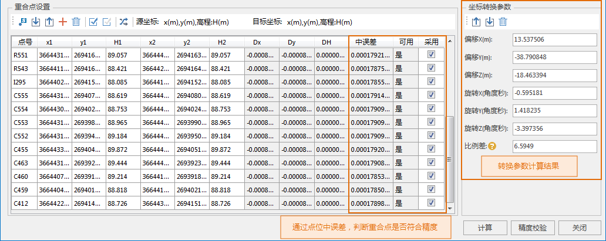

---
id: TransformationParaStep
title: 计算转换模型参数  
--->  
> ### 使用说明

>

> 支持通过重合点选取、坐标转换模型、精度评价等操作，计算出常用的四参数、七参数的参数值，用户可利用该参数值进行数据成果坐标系的转换。

>

>   * **实例**
：用户有一份某区域的1980西安坐标系矢量数据，现在希望将其转为2000国家大地坐标系。该用户在测区内测得一些控制点，这些控制点有1980西安坐标，同时也有2000国家大地坐标。以下以该数据转换为例进行操作步骤的详细说明。

>   * **准备工作** ：选取1980西安坐标系坐标和2000国家大地坐标系坐标的控制点作为重合点文件。

>   * **重合点** 的选取对于转换参数的计算至关重要，用户需选取两个坐标系下均有坐标成果的控制点作为重合点。

>     * **重合点选取的基本原则** ：等级高、精度高、分布均匀、覆盖整个转换区域、局部变形小。

>     * **重合点数量要求**
：一般情况，向2000系转换重合点的选取，不少于6，外部检核点不少于6，点位都要均匀分布覆盖整个转换区域。考虑到可能存在粗差点，需要多准备几个重合点作为备用。总之，重合点应尽可能多选取。

>   
> ---  
> 图：数据重合点  
>

>

> ### 功能入口

>

>   * 在“ **开始** ”选项卡->“ **数据处理** ”组->“ **投影转换** ”->“ **转换模型参数计算**
”项，弹出“转换模型参数计算”对话框。

>

>

> ### 操作步骤

>

> 在“转换模型参数计算”对话框中，设置如下参数：

>

>   
> ---  
> 图：“转换模型参数计算”对话框  
>  
>   1. **转换模型设置** ：选择转换的模型方法，单击“模型方法”标签右侧的下拉按钮，弹出的下拉菜单列表显示了程序提供的五种转换模型，包含
**Position Vector(7-para)（位置矢量变换）、Coordinate Frame
(7-para)（坐标框架旋转变换）、China_3D_7P(7-para)（三维七参数转换模型）、China_2D_7P(7-para)（二维七参数转换模型）
及 China_2D_4P(7-para)（二维四参数转换模型）** 。

>

> 由于转换模型的选取受控制点坐标系及转换区域的影响，采用哪种模型方法要视具体情况而定。在 **《大地测量控制点坐标转换技术规程》**
中给出了关于转换模型适用范围，用户可根据源数据控制点所属坐标系，依照转换模型的适用区域范围选择转换模型。有关转换模型和适用范围请参考[转换模型.](TransformationModel.html)

>

>   2. **设置相互转换的坐标系类型** ，即源坐标系和目标坐标系。程序支持地理坐标系、投影坐标系以及二者的相互转化:

>     * **源坐标系设置** ：可在“源坐标系”处设置源数据的坐标系，坐标系设置有以下两种方式：

>       * **投影设置**
：选择“投影设置”单选框，单击“设置...”按钮，在弹出的“投影设置”窗口中，选择程序提供的一种与源点数据相同的地理坐标系或投影坐标系，将其设置为当前坐标系。设置投影的具体操作，请参考“投影设置”窗口。

>       * **导入投影文件** ：选择“导入投影文件”单选框，单击“选择”按钮，在弹出的“选择”窗口中，选择投影信息文件并导入即可。

>     * **目标坐标系设置** ：设置转换后的数据坐标系类型。设置方式与“源坐标系设置”方式一致。

>   3. **重合点设置**
：输入具有源坐标系坐标和目标坐标系坐标的重合点。重合点坐标格式需同上一步设置的源坐标系和目标坐标系相一致，否则程序将提示控制点坐标格式错误。

>

> 可通过 **创建匹配点串** 、 **导入重合点文件** 及 **手动输入** 三种方式添加重合点：

>     * **创建匹配点串**
：当重合点以数据集形式存在在数据源中，可单独指定源数据、目标数据中重合点字段信息，使源数据与目标数据通过指定字段值建立连接关系，可单击重合点设置工具栏中的“创建匹配点串”按钮，在“创建匹配点串”对话框执行操作。

>     * **导入重合点** ：单击重合点设置工具栏中的“导入”按钮，导入重合点文件（.txt）。重合点文件（.txt）文件格式参考如下图所示：
  
> ---  
> 图：重合点（.txt）文件  
>     * **手动输入** ：单击重合点设置工具栏中的 “添加数据”按钮，在重合点列表框中，新增一条记录，可手动输入重合点对应坐标。

>

> 导入重合点后，在列表框中可查看重合点的详细信息，用户可通过勾选“ **采用**
”处的复选框，设置参与坐标转换参数计算的点。注：采用的控制点对不能少于6组。

>

>   4. **计算坐标转换参数** ：单击“计算”按钮，执行坐标转换参数计算，计算得到如下结果：

>

> ① 程序将重合点代入转换模型，利用最小二乘法计算得到转换参数；包含 **偏移X、偏移Y、偏移Z、旋转X、旋转Y、旋转Z和比例差。**
其中偏移X，偏移Y，偏移Z的单位为“米”；旋转X，旋转Y，旋转Z的单位为“角度秒”；比例差为百万分之一（ppm）。

>

> ② 计算得到 **重合点坐标残差（Dx、Dy、DH)及点位中误差** ，程序判定坐标残差大于3倍点位中误差的重合点为不可用点，即在“ **可用**
”一栏显示为 **“否”** ；反之满足精度要求。

>

> 注：为提高转换参数的精度，用户可将不可用的重合点剔除或设置为不采用，重新计算转换参数。

>

>   
> ---  
> 相关误差计算公式

>     * 重合点残差（Dx、Dy、DH）=重合点转换坐标值-重合点已知坐标值

>     * 点位中误差计算公式：    
> ---  
>     * 平面点位中误差：    
> ---  
>  
>

>   5. **精度校验**
：单击“精度校验”按钮，弹出“精度校验”对话框，导入未参与计算转换参数的重合点作为外部检核点，其点数不少于6个且均匀分布；采用内符合精度和外符合精度评定，依据计算转换参数的重合点残差中误差评估坐标转换精度，残差小于3倍点位中误差的点位精度满足要求。

>   6. **导出转换参数** ：精度校验合格后，单击坐标转换参数组合框中的 “导出”按钮，即可将计算的转换参数导出为投影转换参数文件（*.ctp）。

>   7. 将导出的 **投影转换参数文件（*.ctp）**
对控制点区域的整个数据集进行投影转换，有关数据集投影转换的内容，请参看[数据集投影转换](ConvertPrjCoordSysSingle.html)，在“
**投影转换参数设置** ”对话框中导入计算所得的转换参数。从而实现整个数据集的投影转换。

>

> 将转换后的数据与转换前数据叠加显示结果如下图所示：

>

>   
> ---  
> 图：转换前后数据比对  
>  
>

>

> * * *

>

>   
>  
> ---

