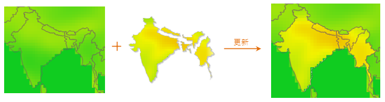

### 使用说明

使用一个或多个栅格数据集的内容去更新另一个栅格数据集的相应部分的内容。

下图展示了批量数据更新的示例：左图为被更新数据，即目标数据，中间是多个栅格数据集的组图，用来更新目标数据相应位置的内容，右图为数据更新后的结果。

    

栅格数据集更新所用到的数据需满足以下要求：

  1. 目标数据集和更新数据集的像素格式需一致；
  2. 两个栅格数据集的范围有重叠部分，只有重叠部分才能使用更新数据集中的值替换相应部分目标数据集中的值。

### 操作步骤

  1. 在“ **数据** ”选项卡的“ **数据处理** ”组的 Gallery 控件中，单击“ **数据更新** ”按钮，弹出“栅格数据集更新”对话框。   

  2. 用户需对如下参数进行设置。 

**目标数据**

当前工作空间下的将要被更新的栅格数据。当确定目标数据，并开始在下方数据来源列表框中添加数据集以后，目标数据源和目标数据集的下拉列表将变灰不可更改。

  * 目标数据源：在右侧下拉列表中，列出了当前工作空间下所有的数据源，从中选择将要被更新的目标数据集所在的数据源。
  * 目标数据集：在右侧下拉列表中，列出了所选数据源中所有的栅格数据集，从中选择将要被更新的目标数据集。

**源数据**

数据来源部分包括列表框和工具条按钮两部分。列表框内显示用于更新目标数据集的一个或多个栅格影像数据集，它们将作为更新数据加载到目标数据集中。

  * 源数据集：用来更新目标数据的栅格或影像数据集。
  * 源数据源：源数据集所在的数据源。
  * 结果：单击“确定”按钮执行更新操作后，列表框中会出现“结果”列，会在该栏中按照操作顺序依次显示源数据集是否成功更新至目标数据。按照列表框中多条记录从下到上的顺序进行数据更新。

此外，可使用列表框右侧的工具条按钮对源数据集进行添加、删除、选择和排序等操作。

工具条按钮说明

  * 单击“添加”按钮，弹出“选择”对话框，通过该对话框可以选择需要合适的栅格数据集作为更新数据。对话框内显示的数据集与目标数据集的类型一致（栅格数据集或影像数据集），以保证是对同一类型的数据集进行更新。
  * 单击“移除”按钮，用来移除列表框中选中的一个或多个记录。
  * 单击“全选”按钮，用来选中列表框中的所有记录。
  * 单击“反选”按钮，用来反向选择列表框中的记录，即原来没有被选择的记录变为选中状态；原来选中的记录变为非选中状态。
  * “上移”按钮：将选中的记录向上移动一位。
  * “下移”按钮：将选中的记录向下移动一位。

  3. “ **执行完成后自动关闭对话框** ”复选框：选中该复选框后，在应用程序完成对所有指定栅格数据集的更新操作后，将自动关闭“栅格数据集更新”对话框；否则，不自动关闭“栅格数据集更新”对话框。

### 备注

在对影像数据进行更新时，如果使用的源数据的编码方式为 DCT，则更新的结果会出现的毛边现象。这是由于 DCT
编码方式是一种有损压缩方式，要数据编码后会修改影像边界值。有关数据集编码方式的介绍，请参见[数据集压缩编码方式](../DataManagement/EncodeType.htm)。建议用户在使用数据更新功能时，尽量不要使用
DCT 编码方式的影像，避免出现毛边现象。

  

