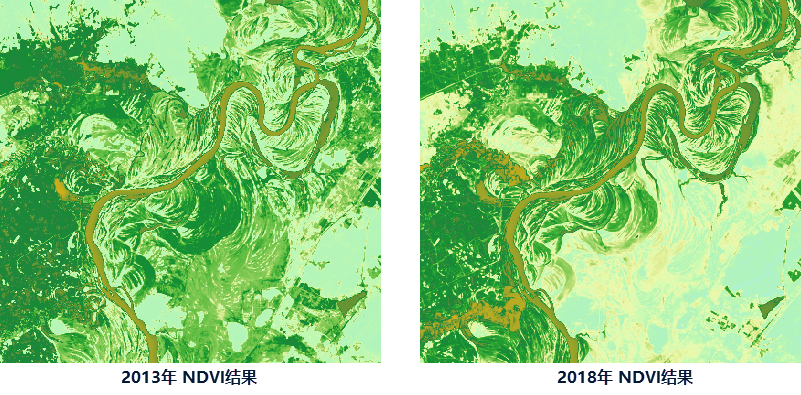
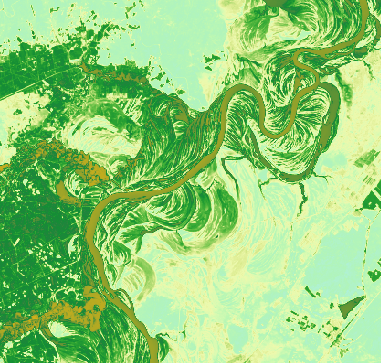

### 功能说明

基于影像数据的波段信息，计算 NDVI 指数，以提取植被指数；计算 NDWI 指数以提取影像的水体信息。

  * **NDVI**

NDVI（ Normalized Difference Vegetation
Index），归一化植被指数。可使植被从水和土中分离出来，能客观地反映植被覆盖量的变化，是植被生长状态及植被覆盖度的最佳指示因子。基于SPOT/VEGETATION
以及 MODIS 等卫星遥感影像得到的 NDVI 可以应用在各尺度区域的植被动态变化监测、土地利用/覆被变化检测、作物和牧草估产及干旱监测等研究中。

NDVI 结果被限定在[-1,1]之间：

  * **负值** 表示地面覆盖为云、水、雪等，对可见光高反射；
  * **0** 表示有岩石或裸土等，NIR 和R 近似相等；
  * **正值** 表示有植被覆盖，且随覆盖度增大而增大；
  
  * **NDWI**

NDWI（Normalized Difference Water
Index），归一化水指数。一般用来提取影像中的水体信息。与NDVI相比，它能有效地提取植被冠层的水分含量；在植被冠层受水分胁迫时，NDWI指数能及时地响应，这对于旱情监测具有重要意义。用NDWI来提取有较多建筑物背景的水体，如城市中的水体，其效果会较差。值大于0.2的为水体数据。

### 功能入口

单击 **数据** 选项卡-> **数据处理** -> **NDVI/NDWI** 按钮。

### 参数说明

  1. 源数据：选择基于分析的影像数据集。
  2. **分析模式** ：支持选择 NDVI 和 NDWI 两种分析模式。 
    * NDVI 是基于影像近红外波段和红色波段的反射率的值得到的。表达式为：NDVI=(NIR-R)/(NIR+R)，NIR 为近红外波段的反射值；R为红光波段的反射值。
    * NDWI 是基于绿波段与近红外波段的归一化比值指数，表达式为：NDWI =(G-NIR)/(G+NIR) ，G 为绿波段；NIR 为近红外波段的反射值
  3. 结果数据：根据选择的分析模式生成一个新的栅格结果数据集，设置结果数据集所在数据源及数据集。

### 应用案例

现有某区域2013年6月和2018年6月的Landsat 8卫星影像数据，通过计算相同区域不同年份的NDVI
指数，对比该区域的植被覆盖动态变化。得到如下结果图：由图可看出2013年植被覆盖相较2018年植被覆盖较茂盛，2018年的植被覆盖率有减少。

 |   
---|---  
2013年 NDVI结果图 | 2018年 NDVI结果图  
  

