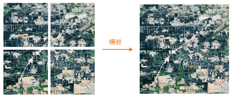
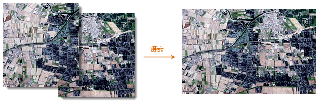
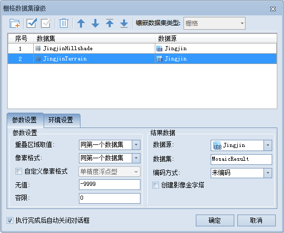
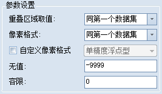
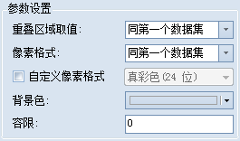
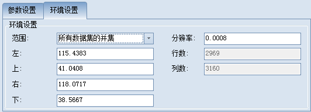

### 使用说明

将两个或两个以上栅格数据集以地理坐标为参照组合成一个栅格数据集。

下面分别展示了两种栅格数据集镶嵌的示例。

  

  

对于多幅边界相邻的栅格数据集，通过栅格镶嵌操作可直接将其拼接起来，镶嵌效果如上图1所示；对于有重叠部分的栅格数据集，系统会提供多种方法处理栅格数据集的重叠部分，具体参见参数设置中的“重叠区域取值”参数说明，镶嵌效果如上图2所示。

### 操作步骤

  1. 在“ **数据** ”选项卡的“ **数据处理** ”组的 Gallery 控件中，单击“ **栅格镶嵌** ”按钮。
  2. 弹出如下图所示的“栅格数据集镶嵌”对话框，该对话框包括添加参与镶嵌的数据集列表、参数设置、环境设置三部分内容。    
---  
图：“栅格数据集镶嵌”对话框  
  3. 在列表框中添加需要进行镶嵌操作的栅格数据集。 
    * **镶嵌数据集类型** ：可参与镶嵌的数据集类型有栅格数据集（GRID）和影像数据集（IMAGE）两类，栅格数据集多用来进行栅格分析，影像数据集多用来进行显示或作为底图。栅格数据集镶嵌只能在同一类数据集之间进行，因此，在添加数据集之前需要确定想要镶嵌的栅格数据集类型，这里默认为栅格数据集。选择数据集类型后，系统会根据所选的栅格数据集类型进行自动过滤。 

此外，将数据集添加至列表框以后，选择数据集类型的下拉列表框变为灰色，呈只读状态，如果用户想改变镶嵌数据集的类型，需要先将列表框内的数据集移除后方可选择。

工具条按钮说明

  * 按钮：单击“添加”按钮，弹出“选择”对话框，通过该对话框可以选择需要镶嵌的栅格数据集，这里的栅格数据集的类型由镶嵌类型控制。
  * 按钮：单击“移除”按钮，用来移除列表框中选中的一个或多个记录。
  * 按钮：单击“全选”按钮，用来选中列表框中的所有记录。此外，选中一条或多条记录后，按 Delete 键也可进行删除操作。
  * 按钮：单击“反选”按钮，用来反向选择列表框中的记录，即原来没有被选择的记录变为选中状态；原来选中的记录变为非选中状态。
  * 按钮：将选中的记录向上移动一位。
  * 按钮：将选中的记录向下移动一位。
  * 按钮：将选中的记录移动至表格第一条。
  * 按钮：将选中的记录移动至表格最后一条。

  4. 进行栅格数据集镶嵌的参数设置。 

### 参数设置

 |   
---|---  
图：栅格参数 | 图：影像参数  
  
由于栅格数据集和影像数据集自身的差异性，二者的参数设置也略有不同。下面将详细介绍栅格数据集和影像数据集的各项参数。

栅格数据参数设置

  * **重叠区域取值** ：系统提供的对地理范围上有重叠区域的待镶嵌数据集的处理方法，通过处理该区域像元值来完成数据集的镶嵌。对于栅格数据集，其像元值为地物的属性值，如高程、降水量等。取值方式包括以下五种： 
    * 同第一个数据集：取列表框中排在最前的栅格数据集的像元值作为重叠区域的值。
    * 同最后一个数据集：取列表框中排在最后的栅格数据集的像元值作为重叠区域的值。
    * 所有数据集的最大值：取参与镶嵌的所有栅格数据集其相应位置的像元值的最大值。
    * 所有数据集的最小值：取参与镶嵌的所有栅格数据集其相应位置的像元值的最小值。
    * 所有数据集的平均值：取参与镶嵌的所有栅格数据集其相应位置的像元值的平均值。
  * **像素格式** ：设置结果数据集的像素格式。 
    * 同第一个数据集：取列表框中排列最前的栅格数据集的像素格式。
    * 同最后一个数据集：取列表框中排在最后的栅格数据集的像素格式。
    * 精度最高：选择参与镶嵌的所有栅格数据集中最大的像素格式。
    * 精度最低：选择参与镶嵌的所有栅格数据集中最小的像素格式。
    * 出现频率最高：选择参与镶嵌的所有栅格数据集中出现频率最高的像素格式，如果像素格式出现的频率相同，则按照数据集在列表框中的存放顺序由上到下选择。
  * **自定义像素格式** ：勾选“自定义像素格式”前面的复选框后，上方“像素格式”参数将变灰不可用。自定义的像素格式包括：1位、4位、单字节、双字节、整型、长整型、单精度浮点型、双精度浮点型8种。像素格式的具体说明请参见[栅格数据集像素格式](../../Analyst/VectorRasterConvert/PixelFormat.htm)。
  * **无值** ：这里设定的是镶嵌后数据集为空值的值，即参与镶嵌的栅格数据集中单元格的值在无值数据的设置范围内时，这些单元格在结果数据集的相应位置为空值。
  * **容限** ：设置无值数据的容限，假设无值数据设为 r、容限值设为 a 时，无值数据的范围是 [r-a, r+a]。

影像数据参数设置

  * **重叠区域取值** ：系统提供的对地理范围上有重叠区域的待镶嵌数据集的处理方法，通过对该区域像元值的处理来完成数据集的镶嵌。对于影像数据集，其像元值为颜色值或颜色索引值。取值方式包括以下两种： 
    * 同第一个数据集：取列表框中排列第一的影像数据集的像元值作为重叠区域的值。
    * 同最后一个数据集：取列表框中排在最后的影像数据集的像元值作为重叠区域的值。
    * 所有数据集的最大值：对所有参与镶嵌的栅格数据集，分别取像元中 R、G、B 三个分量的最大值，组成一个新的颜色值，作为重叠区域的值。
    * 所有数据集的最小值：对所有参与镶嵌的栅格数据集，分别取像元中 R、G、B 三个分量的最小值，组成一个新的颜色值，作为重叠区域的值。
    * 所有数据集的平均值：对所有参与镶嵌的栅格数据集，分别取像元中 R、G、B 三个分量的平均值，组成一个新的颜色值，作为重叠区域的值。
  * **像素格式** ：设置结果数据集的像素格式，注意：进行影像数据集镶嵌时，像素格式不支持单精度和双精度浮点型。 
    * 同第一个数据集：取列表框中排列最前的影像数据集的像素格式。
    * 同最后一个数据集：取列表框中排在最后的影像数据集的像素格式。
    * 精度最高：选择参与镶嵌的所有影像数据集中最大的像素格式。
    * 精度最低：选择参与镶嵌的所有影像数据集中最小的像素格式。
    * 出现频率最高：选择参与镶嵌的所有影像数据集中出现频率最高的像素格式，如果像素格式出现的频率相同，则按照数据集在列表框中的存放顺序由上到下选择。
  * **自定义像素格式** ：勾选“自定义像素格式”前面的复选框后，上方“像素格式”参数将变灰不可用。自定义的像素格式包括：黑白单色、16色、256色、彩色、真彩色和增强真彩色6种。像素格式的具体说明请参见[栅格数据集像素格式](../../Analyst/VectorRasterConvert/PixelFormat.htm)。
  * **背景色** ：设置结果数据集的背景色，当栅格镶嵌运算过程中遇到这种颜色的单元格时，将其视为背景色，不参加运算。
  * **容限** ：设置背景颜色的容限，假设忽略背景色设置的颜色为 (r, g, b)、容限设置为 a，则忽略背景色的颜色范围在 (r-a, g-a, b-a) 到 (r+a, g+a, b+a)之间。

### 结果数据

  * **数据源** ：结果数据集所在数据源，默认为被镶嵌数据集所在数据源。
  * **数据集** ：结果数据集的名称。
  * **编码方式** ：设置结果数据集的编码方式，包括 SGL、DCT、LZW、PNG、复合编码等编码方式，默认为不进行编码。具体编码方式说明请参见[数据集压缩编码方式](../../DataProcessing/DataManagement/EncodeType.htm)。 

栅格数据集编码方式的变化参见下表，左侧一列为栅格数据集的原始编码方式，右侧分别列出了在不同像素格式下适用的编码方式。

原始编码 | 可用编码  
---|---  
  | 1位 | 4位 | 单字节 | 双字节 | 整型 | 长整型 | 单精度浮点型 | 双精度浮点型  
NONE | LZW | LZW | LZW, SGL | LZW, SGL | LZW, SGL | NONE | LZW, SGL | LZW, SGL  
SGL | LZW | LZW | SGL | SGL | SGL | NONE | SGL | SGL  
LZW | LZW | LZW | LZW | LZW | LZW | NONE | LZW | LZW  
  
影像数据集编码方式的变化参见下表，左侧一列为影像数据集的原始编码方式，右侧分别列出了在不同像素格式下适用的编码方式。

原始编码 | 可用编码  
---|---  
  | 黑白单色 | 16色 | 256色 | 彩色 | 真彩色 | 增强真彩色  
NONE | LZW, PNG | LZW, PNG | LZW, DCT, PNG，复合编码 | LZW, DCT, 复合编码 | LZW, DCT,
PNG，复合编码 | LZW, DCT, PNG，复合编码  
LZW | LZW | LZW | LZW | LZW | LZW | LZW  
DCT | LZW | LZW | DCT | DCT | DCT | DCT  
PNG | PNG | PNG | PNG | DCT | PNG | PNG  
复合编码 | LZW | LZW | 复合编码 | 复合编码 | 复合编码 | 复合编码  
  * **创建影像金字塔** ：是否创建影像金字塔，默认为不勾选。在进行大数据量的栅格数据集镶嵌时，建议创建影像金字塔，以提高浏览速度。
  5. 进行栅格数据集镶嵌的环境设置。 

环境设置界面如下图所示：

  
---  
  
指定结果数据集的范围，默认为“所有数据集的并集”，即为参加镶嵌的所有数据集其范围的并集。此外，也可以选择某一栅格数据集的范围。在指定结果数据集的范围后，用户可对该数据集的范围进行微调，包括结果数据集的四个边界的位置和栅格数据集的分辨率。

  6. 完成栅格镶嵌相关参数的设置后，单击“确定”按钮，执行栅格镶嵌操作。 

### 注意事项

当进行影像数据集的镶嵌时，像素格式不支持单精度和双精度浮点型。

