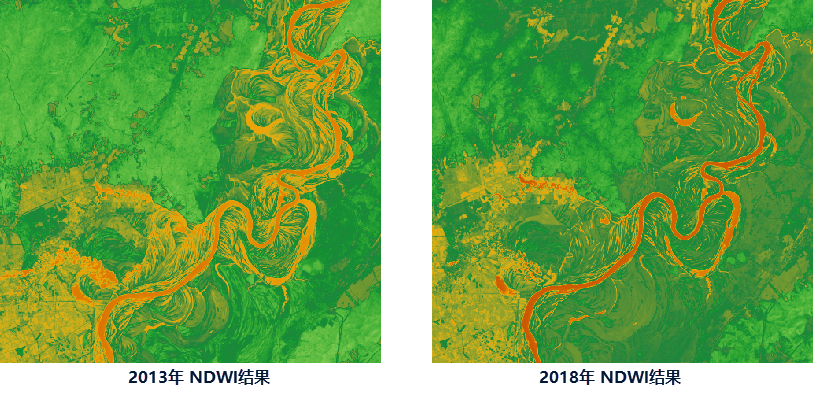
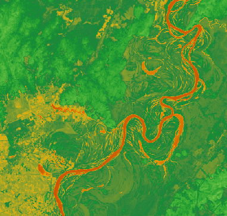

---
id: NDWI
title: NDWI  
--->  
> ### 功能说明

>

> NDWI（Normalized Difference Water
Index），归一化水指数。一般用来提取影像中的水体信息。与NDVI相比，它能有效地提取植被冠层的水分含量；在植被冠层受水分胁迫时，NDWI
指数能及时地响应，这对于旱情监测具有重要意义。用 NDWI 来提取有较多建筑物背景的水体，如城市中的水体，其效果会较差。

>

> NDWI 是基于绿波段与近红外波段的归一化比值指数，表达式为： **NDWI =(G-NIR)/(G+NIR)** ，G 为绿色波段；NIR
为近红外波段的反射值

>

> 可通过多种卫星遥感数据计算 NDWI
指数，用户在使用功能前需了解遥感数据类型，区分遥感数据的波段含义，对于常见卫星遥感影像波段介绍请参看[数据说明](NDVI.html#1)。

>

> ###  操作说明

>

> ### 功能入口

>

> 单击 **数据** 选项卡-> **数据处理** -> **NDWI** 按钮。

>

> ### 参数说明

>

>   1. **绿波段** ：设置参与计算的绿波段，若影像为单波段数据集，则选择绿色波段数据集；若为多波段数据集，则选择数据集中的绿色波段。

>   2. **近红外波段** ：设置参与计算的近红外波段，若影像为单波段数据集，则选择近红外波段数据集；若为多波段数据集，则选择数据集中的近红外波段。

>   3. **结果数据** ：设置结果数据集所在数据源及数据集，程序将根据设置的绿色波段和近红外波段，按照 NDWI 表达式生成一个栅格结果数据集。

>

>

> ### 应用案例

>

> 现有某区域2013年6月和2018年6月的Landsat 8卫星影像数据，通过计算相同区域不同年份的NDWI 指数，查看水体信息，得到如下结果图。

>

>  |   
> ---|---  
> 2013年 NDWI结果图 | 2018年 NDWI结果图  
>  
> ###  相关主题

>

>   * [**NDVI**](NDVI.html)

>

  
>

>

> * * *

>

>   
>  
> ---

