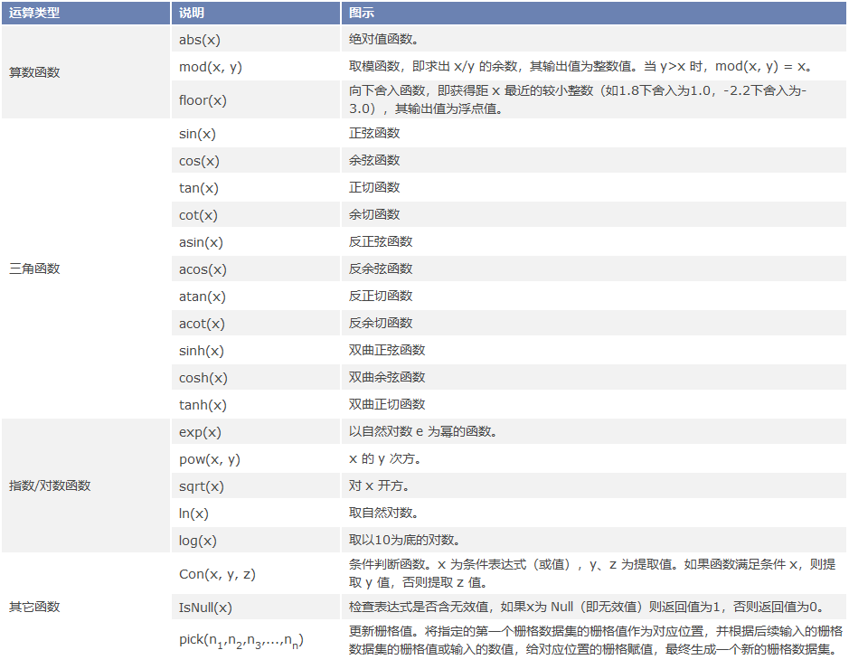
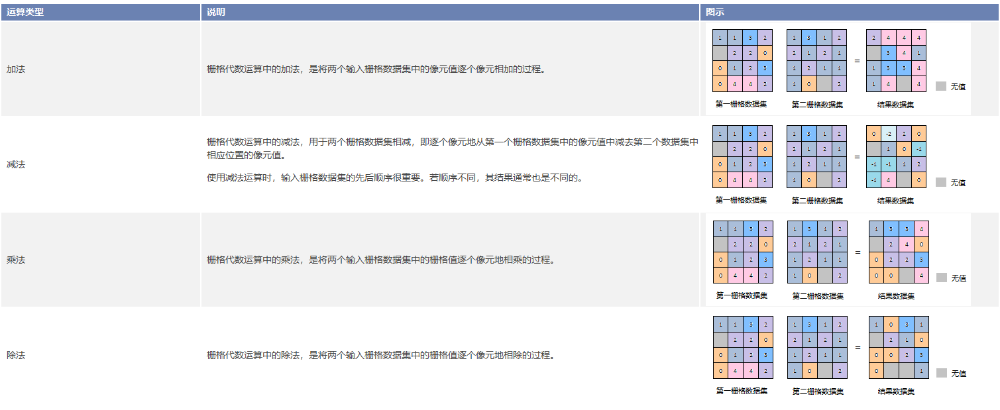

 ### 使用说明

代数运算是运用代数学的观点对地理特征和现象进行空间分析，即对一个或多个栅格数据进行数学运算和函数运算。同时，运算得出的结果栅格数据的像元值是由一个或多个输入栅格数据的同一位置的像元值通过代数运算得到的。

 为了更好的实现栅格代数运算功能，SuperMap
提供了丰富的运算符、函数和运算表达式，除了常用的算术运算（如加、减、乘、除和取整等）方法，还支持通过用户自定义的表达式，来进行栅格的算术运算、条件运算、逻辑运算、函数运算（包括常用函数、三角函数等）和复合运算，用户可以通过栅格代数运算实现多种栅格分析需求。

 ### 功能入口

 * **数据** 选项卡-> **数据处理** ->**栅格** -> **代数运算** 。

 * **工具箱** -> **数据处理** -> **栅格** -> **代数运算** 。(iDesktopX)


 ### 参数说明


 * 设置代数运算表达式：不同类型的代数运算表达式（包括数据集、数字、常量、运算符、函数等）将以不同的字体风格显示在表达式对话框中，便于用户区分。此外，在表达式对话框内，可以通过单击鼠标右键，在弹出的右键菜单中选择相关编辑选项（包括“剪切”、“复制”、“粘贴”和“清除表达式”等）对已有表达式进行编辑，也可以使用
Windows 快捷键（如 Ctrl+X、Ctrl+C、Ctrl+V、Delete
等）实现编辑操作。在编辑代数运算表达式时，建议用户将一个表达式作为一个整体进行编辑，这样可以保留它们独有的字体风格。

 此外，代数运算表达式的组成应遵循如下规则：

* 引用数据集作为运算操作数时，其格式为[数据源名. 数据集名]，例如在数据源 Jingjin 中的 BeijingTerrain
数据集的引用为：[Jingjin. BeijingTerrain]。

* 算术运算符的操作数可以是一个数据集、数字或者常量（如对一个数值的函数运算的结果）。

* 数学函数的自变量可以是一个数值，也可以为某个数据集，或者是一个数据集或多个数据集的运算表达式。

* 当负数作为操作数时，要加上小括号（）。

* 表达式中必须至少含有一个输入栅格数据集。

 * **常用函数**


 除了常用的运算符以外，SuperMap
还提供了21种常用的函数，包括算术运算函数、三角函数、指数/对数函数和其它函数四种，下面将详细介绍各类函数的内容。


**常用函数使用说明** 
   

 * **常用运算符**

 SuperMap 提供的常用运算符包括基本的算术运算符、关系运算符和逻辑运算符三类，如下图所示。单击运算符所在按钮即可在上方的表达式对话框中显示相应的运算符号。


   
 ---  

 **算术运算**


 常用的算术运算包括加法（+）、减法（-）、乘法（*）和除法（/），下表将详细介绍各种运算方法在进行栅格代数运算时是怎样使用的。


**算术运算符使用说明**   
   

 **逻辑运算**

* 逻辑运算又称布尔运算，对输入栅格数据集中的像元值进行"真"或"假"的条件判断，并以二进制（1和0）的形式输出。其运算结果用1或0表示，1在逻辑上代表"真"，即满足代数运算表达式要求的栅格像元；0在逻辑上代表"假"，即不满足代数运算表达式要求的栅格像元。

 常用的逻辑运算包括 And（与）、Or（或）、Not（非）和 Xor（异或），下面将详细介绍各逻辑运算方法

* **And** ：表示逻辑“与”，在表达式对话框中用 & 表示。当且仅当栅格数据集的像元值同时满足两个代数运算表达式时，该像元值为真，并赋值为1，否则为假，赋值为0。

* **Or** ：表示逻辑“或”，在表达式对话框中用 | 表示。当栅格数据集的像元值至少满足两个代数运算表达式中的其中一个时，该像元值为真，并赋值为1；若栅格数据集的像元值均不满足这两个代数运算表达式，该像元值为假，赋值为0。

* **Not** ：表示逻辑“非”，在表达式对话框中用 Not( ) 表示。当栅格数据集的像元值不满足所列代数运算表达式时，该像元值为真，并赋值为1，否则为假，赋值为0。

* **Xor** ：表示逻辑“异或”，在表达式对话框中用 ^ 表示。当且仅当栅格数据集的像元值只满足两个代数运算表达式中的其中一个时，该像元值为真，并赋值为1；若栅格数据集的像元值同时满足（或同时不满足）这两个代数运算表达式时，该像元值为假，并赋值为0。

 * **结果数据**

    * **数据源** ：列出了当前工作空间下所有的数据源，选择结果数据集所要保存的数据源。

    * **数据集** ：设置结果数据集的名称。

    * **像素格式**：设置结果数据集的像素格式，应用程序提供了提供了1位、4位、8位、16位、32位、64位、单精度浮点型和双精度浮点型等11种格式，每种格式的具体说明请参见[栅格数据集像素类格式](../../Analyst/VectorRasterConvert/PixelFormat)。

    * **对数据集进行压缩储存** ：勾选该复选框以后，系统会对结果数据集进行压缩存储，否则将不进行压缩存储。

    * **忽略无值栅格单元**：勾选该复选框以后，输入栅格数据集中的无值栅格单元将不参与代数运算，结果数据集中相应位置的像元值仍为空值（通常为-9999）；若不勾选该项，则系统会将无值栅格单元的像元值作为普通像元值参与运算，此时会导致结果栅格数据集的极小值（或极大值）发生改变。


    输入栅格数据集中无值栅格单元的像元值可以在该数据集的属性窗口中查看，具体步骤如下：


    * 在工作空间管理器中，右键单击参与栅格代数运算的输入栅格数据集，在弹出的右键菜单中选择“属性”命令。

    * 在弹出的“属性”窗口左侧目录树中单击栅格数据集节点，在右侧的图像属性区即可看到表示空值（即无值栅格单元）的像元值，通常为-9999。

 * 导入/导出代数运算的参数。用户可通过左下方的“导入/导出”按钮以配置文件的形式设置“栅格代数运算”的参数。

    * **导入** ：单击“导入”按钮，将保存为 *.xml 格式的代数运算配置文件直接导入到“栅格代数运算”对话框中显示。

    * **导出** ：单击“导出”按钮，可以将表达式对话框中的代数运算表达式及其它相关的参数设置以 * .xml 格式保存到文件中，便于以再次使用。导出文件结构如下： 导出文件结构 


```  
<?xml version="1.0" encoding="UTF-8"?>

<SmXml:MathOperation xmlns:SmXml="http://www.supermap.com/xml">

  <SmXml:ExpressionCon( [DEM.dem] > 1000,1,-9999)</SmXml:Expression>;

  <SmXml:PixelFormat>6400</SmXml:PixelFormat>

  <SmXml:BZip>TRUE</SmXml:BZip>

  <SmXml:BNoValue>TRUE</SmXml:BNoValue>

  <SmXml:BShowProgress>TRUE</SmXml:BShowProgress>

</SmXml:MathOperation>

<Expression> 字段用于存储表达式对话框内的代数运算表达式。
<PixelFormat>字段表示结果数据集的像素存储类型，其中1表示1位、4表示4位、8表示单字节、16表示双字节、320表示整型、64表示长整型、3200表示单精度浮点型、6400表示双精度浮点型。
<BZip> 表示是否对数据集进行压缩存储，FALSE 为不进行压缩，TRUE 为进行压缩。
<BNoValue> 表示是否忽略无值栅格单元，TRUE 为忽略无值栅格单元，FALSE 为不忽略。
<BShowProgress> 表示是否显示进度条。  
```  

* 单击“ **环境设置**”按钮，设置分析环境参数，栅格代数运算支持设置的分析环境参数包括结果数据集的地理范围、裁剪范围，具体描述请参见[设置分析环境](../../Analyst/Raster/AnalystEnvironment)页面。

注意：支持将环境参数设置为全局变量，即将此处设置的参数值作为总栅格环境分析环境参数，其他支持环境参数设置的功能，无需再重复设置。如果在此处不设置环境参数，则分析时读取栅格分析环境中该参数的设置。
 完成栅格代数运算相关参数的设置后，即可执行栅格代数运算操作。


