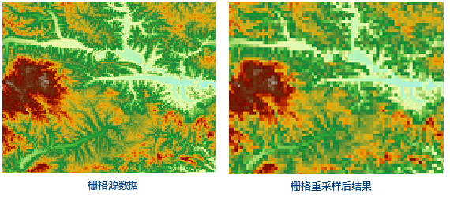

### 使用说明

生成新的栅格数据集，同时将原始栅格数据集的像元值自身或推导值赋予新生成的栅格数据集的每个像元。

### 操作步骤

1. 在“ **数据** ”选项卡的“ **数据处理** ”组的 Gallery 控件中，单击 **栅格重采样** 按钮，弹出“栅格重采样”对话框。 
2. 用户需对如下参数进行设置。 

### 源数据

  * **数据源** ：列出了当前工作空间中所有的数据源，选择需要进行重采样的数据集所在的数据源。
  * **数据集** ：列出了当前数据源中所有的栅格数据集，包括栅格数据集（GRID）和影像数据集（IMAGE）。在列表中选择需要进行重采样的数据集，这里会自动定位到工作空间管理器内选中的数据集。注意，栅格数据重采样不支持多波段影像数据。

### 结果数据

  * **数据源** ：列出了当前工作空间中所有的数据源，选择结果数据集所在的数据源。默认与源数据源相同。
  * **数据集** ：设置结果数据集的名称，结果数据集的类型与源数据集相同。

### 参数设置

  * **采样模式** ：SuperMap 提供了三种栅格重采样方法：最邻近法、双线性内插法和三次卷积内插法，各种方法的具体说明请参见[栅格重采样方法介绍](../../DataProcessing/Registration/resamplemethod.htm)。 

**最邻近法**
：将输入栅格数据集中最邻近的像元值作为输入值，赋予输出栅格数据集的相应像元。该方法不会改变原始栅格值，而且处理速度快。适用于表示分类或某种专题的离散数据，如土地利用、植被类型等。

**双线性内插法**
：将输入栅格数据集中的4个最邻近像元值的加权平均值赋予输出栅格数据集的相应像元。该方法的处理结果比最邻近法更加平滑，但会改变原来的栅格值。适用于表示某种现象分布或地形表面的连续数据，如
DEM、降雨量分布、坡度等。

**三次卷积内插法**
：与双线性内插法类似，将输入栅格数据集中的16个最邻近像元值的加权平均值赋予输出栅格数据集的相应像元。该方法的处理结果最为清晰，栅格数据的边界会有锐化效果，但计算量大，处理时间较长。适用于航片和遥感影像的重采样。

  * **分辨率** ：设置输出栅格数据集的分辨率。默认分辨率与输入栅格数据集分辨率的2倍。
  * **列数** ：输出栅格数据集中像素的列数，不可手动修改，由“分辨率”参数控制。默认列数与输入栅格数据集的列数相同。
  * **行数** ：输出栅格数据集中像素的行数，不可手动修改，由“分辨率”参数控制。默认行数与输入栅格数据集的行数相同。
3. “ **对数据源里所有栅格影像批量重采样** ”复选框：选中该复选框后，应用程序会按照相关的参数设置，对数据源中所有的栅格、影像数据集进行批量重采样。
4. 单击“ **环境设置** ”按钮，设置分析环境参数，栅格重采样只支持设置裁剪范围，具体描述请参见<[设置分析环境](../../Analyst/Raster/AnalystEnvironment.htm)页面。 

注意：支持将环境参数设置为全局变量，即将此处设置的参数值作为总栅格环境分析环境参数，其他支持环境参数设置的功能，无需再重复设置。如果在此处不设置环境参数，则分析时读取栅格分析环境中该参数的设置。

5. 完成栅格重采样相关参数的设置后，单击“确定”按钮，执行栅格重采样操作。
  
